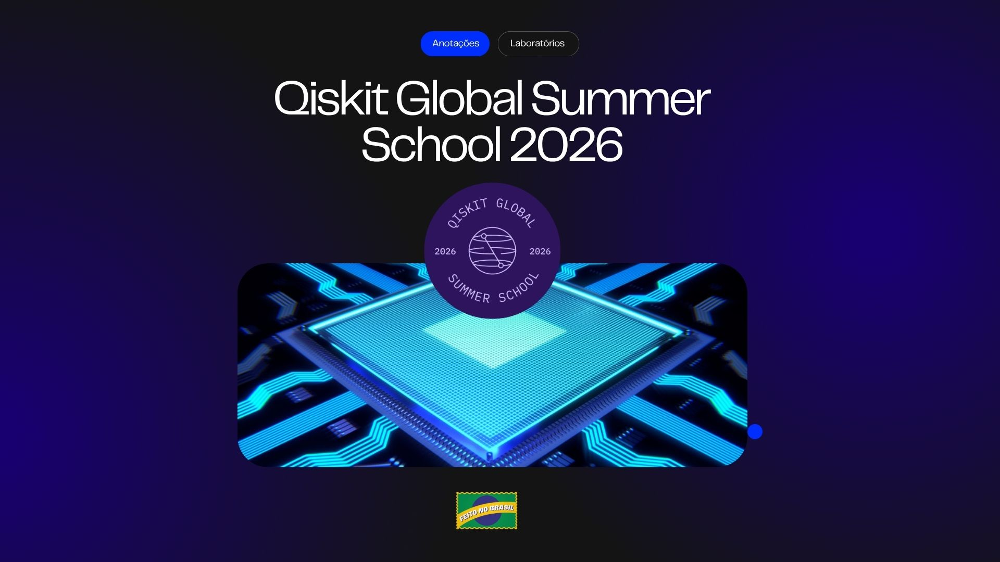

  

# Qiskit Global Summer School 2026

### Anotações, exercícios e laboratórios sobre computação quântica com Qiskit

 

  

---

## Sobre este repositório

Este repositório foi criado para registrar minha trajetória no **Qiskit Global Summer School 2026**.

Aqui estão organizados:

- anotações de cada dia;
- conceitos importantes;
- códigos desenvolvidos durante as aulas;
- exercícios;
- laboratórios;
- referências úteis.

## 📊 Progresso geral

### Anotações

- [Dia 1 — Introdução à computação quântica](anotacoes/dia-01-introducao.md)
- Dia 2 — Mecânica quântica
- Dia 3 — Programação quântica
- Dia 4 — Emaranhamento
- Dia 5 — Ruído e hardware
- Dia 6 — Quantum + HPC
- Dia 7 — Algoritmos e simulação
- Dia 8 — Métodos baseados em amostragem
- Dia 9 — Otimização
- Dia 10 — Encerramento

### Laboratórios

- Lab 1
- Lab 2
- Lab 3
- Lab 4
### Workshops

- Workshop 1 — Why Does Quantum Computing Seem Scary?
- Workshop 2 — How to Use GitHub
- Workshop 3 — How to Read an Academic Paper
- Workshop 4 — From Coffees to Contracts: How to Network

