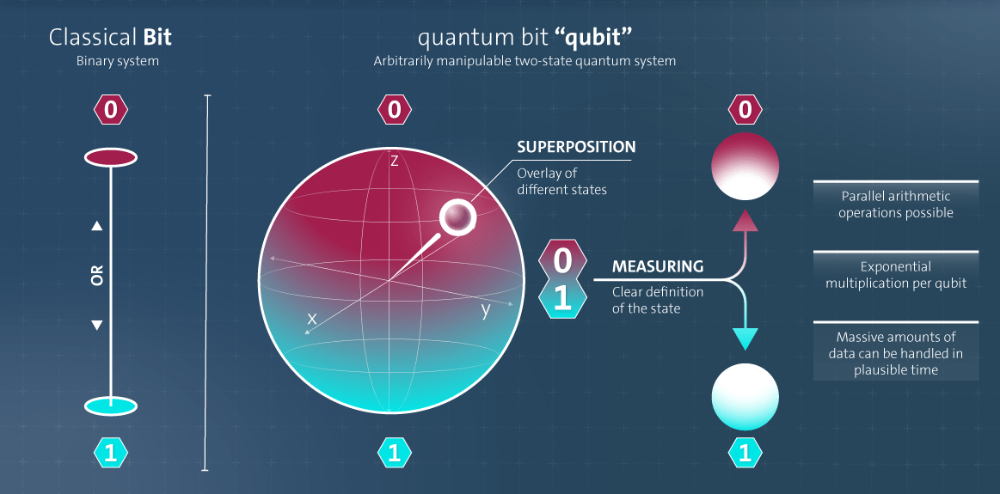
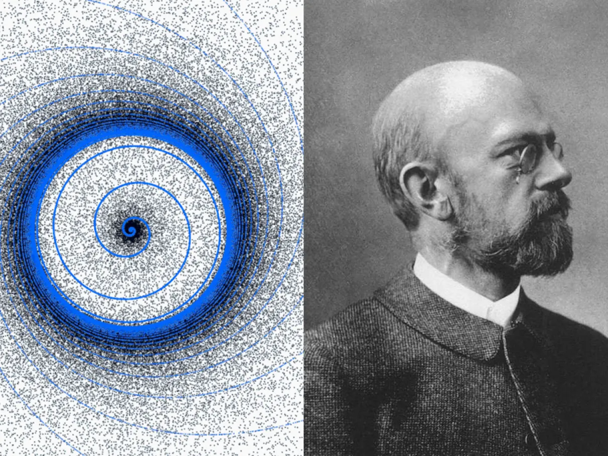
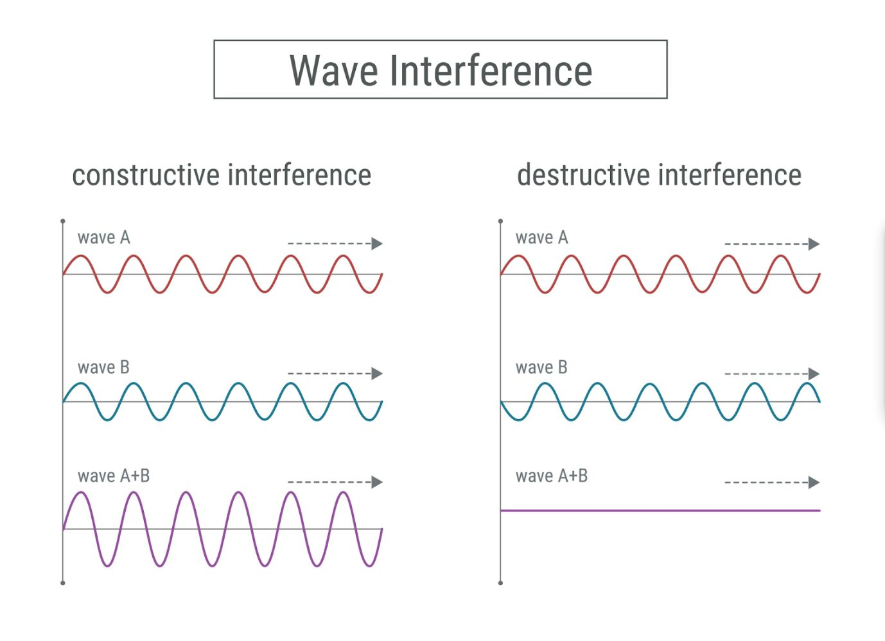

# Dia 1 — Introdução à Computação Quântica

> **Data:** 13 de julho de 2026  
> **Evento:** Qiskit Global Summer School 2026  
> **Tema da aula:** Why Quantum? What Problem Are We Solving?

---

## Sobre estas anotações

Estas anotações foram produzidas a partir do conteúdo apresentado durante a live do **Qiskit Global Summer School 2026**, promovido pela IBM Quantum.

Ou seja, eu só reorganizei os conceitos e reescrevi de acordo com o que compreendi durante a apresentação.
---

---

## Resumo do Dia 1

Neste primeiro dia, compreendi que:

- a computação quântica utiliza fenômenos da mecânica quântica;
- o qubit é a unidade básica de informação quântica;
- um qubit pode estar em superposição;
- as amplitudes determinam as probabilidades de medição;
- a soma das probabilidades deve ser igual a \(1\);
- um circuito possui inicialização, portas, medição e pós-processamento;
- o Espaço de Hilbert cresce exponencialmente com a quantidade de qubits;
- superposição sozinha não produz aceleração útil;
- o emaranhamento representa correlações quânticas;
- a interferência reforça possibilidades úteis e cancela possibilidades indesejadas;
- o Algoritmo de Deutsch demonstra uma vantagem quântica simples;
- computadores quânticos de grande escala dependerão de qubits lógicos, correção de erros e tolerância a falhas.

---

## O que é computação quântica?

A computação quântica não é mágica, é uma tecnologia que utiliza as leis da mecânica quântica para solucionar problemas antes considerados insolúveis ou muito difíceis para computadores clássicos.

Ela utiliza o **qubit**, que é um objeto quântico controlável e representa a unidade de informação da computação quântica.

Um **circuito quântico** é formado por um conjunto de operações realizadas por portas quânticas sobre os qubits.

De maneira simplificada:

```text
Qubits + portas quânticas + medição = circuito quântico
```

---

## O que é um qubit?

O qubit é a unidade básica de informação da computação quântica.

Enquanto um bit clássico pode assumir apenas um dos valores abaixo:

```text
0 ou 1
```

um qubit pode estar em uma combinação dos estados `0` e `1`.

Esse estado é representado por:

$$
|\psi\rangle = a|0\rangle + b|1\rangle
$$

Onde:

- \( |\psi\rangle \) representa o estado do qubit;
- \( |0\rangle \) representa o estado zero;
- \( |1\rangle \) representa o estado um;
- \(a\) e \(b\) são amplitudes de probabilidade.

<p align="center">  </p> <p align="center">
---

## O que é superposição quântica?

A superposição quântica ocorre quando uma partícula quântica pode existir em múltiplos estados ou locais ao mesmo tempo.

Um qubit não precisa escolher imediatamente entre `0` e `1`. Antes da medição, ele pode estar em uma combinação dos dois estados:

$$
a|0\rangle + b|1\rangle
$$

Isso não significa apenas que não sabemos qual é o estado. Significa que o próprio estado quântico é uma combinação de \( |0\rangle \) e \( |1\rangle \).

---

## Notação de Dirac

Os símbolos \( |0\rangle \) e \( |1\rangle \) fazem parte da chamada **Notação de Dirac**.

Essa notação, formada por uma barra vertical e um sinal semelhante a uma chave angular, é utilizada para representar estados quânticos.

```text
|0⟩ = estado zero
|1⟩ = estado um
```

O símbolo completo é chamado de **ket**.

Por exemplo:

$$
|\psi\rangle
$$

é lido como “ket psi”.

---

## O que são as amplitudes \(a\) e \(b\)?

Os valores \(a\) e \(b\) são chamados de **amplitudes de probabilidade**.

Eles definem o peso de cada estado dentro da superposição.

- Se a amplitude \(a\) for maior, o qubit terá maior probabilidade de ser medido como \(0\).
- Se a amplitude \(b\) for maior, o qubit terá maior probabilidade de ser medido como \(1\).

Essas amplitudes podem ser números reais ou complexos.

A condição de normalização é:

$$
|a|^2 + |b|^2 = 1
$$

Isso garante que a soma das probabilidades seja igual a \(100\%\).

---

## Medição e Regra de Born

O “segredo” da mecânica quântica é que não podemos observar diretamente uma superposição sem afetá-la.

Quando medimos o qubit, obtemos um resultado clássico:

```text
0 ou 1
```

As probabilidades são calculadas pela **Regra de Born**:

$$
P(0) = |a|^2
$$

$$
P(1) = |b|^2
$$

Portanto:

- \( |a|^2 \) é a probabilidade de medir o estado \( |0\rangle \);
- \( |b|^2 \) é a probabilidade de medir o estado \( |1\rangle \).

A soma deve ser:

$$
P(0) + P(1) = 1
$$

ou:

$$
100\%
$$


---

## Exemplo de cálculo das probabilidades

Considere o seguinte estado quântico:

$$ |\psi\rangle = \frac{\sqrt{3}}{2}|0\rangle - \frac{1}{2}i|1\rangle $$

Podemos identificar:

$$
a = \frac{\sqrt{3}}{2}
$$

$$
b = -\frac{1}{2}i
$$

O símbolo \(i\) representa a unidade imaginária:

$$
i^2 = -1
$$

### Probabilidade de medir \( |0\rangle \)

De acordo com a Regra de Born:

$$
P(0) = |a|^2
$$

Substituindo \(a\):

$$
P(0) =
\left|
\frac{\sqrt{3}}{2}
\right|^2
$$

Como o valor é real:

$$
P(0) =
\left(
\frac{\sqrt{3}}{2}
\right)^2
$$

Calculando:

$$
P(0) =
\frac{(\sqrt{3})^2}{2^2}
$$

$$
P(0) = \frac{3}{4}
$$

$$
P(0) = 0{,}75
$$

Logo:

$$
P(0) = 75\%
$$

### Probabilidade de medir \( |1\rangle \)

Para o estado \( |1\rangle \):

$$
P(1) = |b|^2
$$

Substituindo \(b\):

$$
P(1) =
\left|
-\frac{1}{2}i
\right|^2
$$

O módulo de \(i\) é igual a \(1\), então:

$$
P(1) =
\left(
\frac{1}{2}
\right)^2
$$

$$
P(1) = \frac{1}{4}
$$

$$
P(1) = 0{,}25
$$

Logo:

$$
P(1) = 25\%
$$

### Verificação

A soma fecha perfeitamente:

$$
75\% + 25\% = 100\%
$$

ou:

$$
\frac{3}{4} + \frac{1}{4} = 1
$$

Portanto, nesse estado:

- existe **75% de chance** de medir \( |0\rangle \);
- existe **25% de chance** de medir \( |1\rangle \).

---

## Fluxo de trabalho da computação quântica

O fluxo básico de um cálculo quântico pode ser dividido em quatro etapas.

### 1. Inicialização

Todo cálculo começa com os qubits preparados em um estado inicial conhecido.

Normalmente, todos começam no estado zero:

$$
|00\ldots0\rangle
$$

Em um circuito com dois qubits, \(q_0\) e \(q_1\), o estado inicial seria:

$$
|00\rangle
$$

Isso significa que:

```text
q₀ = |0⟩
q₁ = |0⟩
```

### 2. Execução das portas quânticas

Depois da inicialização, aplicamos portas quânticas aos qubits.

Essas portas podem:

- alterar os estados;
- criar superposição;
- produzir emaranhamento;
- modificar as fases;
- criar interferência;
- fazer os qubits interagirem.

No desenho de um circuito, as portas aparecem como caixas posicionadas sobre as linhas dos qubits.

### 3. Medição

Depois das operações, realizamos a medição dos qubits.

O resultado da medição transforma a informação quântica em informação clássica.

Cada qubit medido produz:

```text
0 ou 1
```

Em um circuito com vários qubits, os resultados formam sequências chamadas de **bitstrings**.

Exemplos:

```text
00
01
10
11
```

### 4. Pós-processamento

Depois da execução do circuito, utilizamos os resultados clássicos para calcular aquilo que nos interessa.

Esses resultados podem ser utilizados em problemas relacionados a:

- física;
- química;
- matemática;
- otimização;
- simulação;
- aprendizado de máquina;
- ciência dos materiais.

O fluxo pode ser resumido assim:

```text
Inicialização
      ↓
Portas quânticas
      ↓
Medição
      ↓
Bitstrings
      ↓
Pós-processamento clássico
```

---

## O que é o Espaço de Hilbert?

Na física quântica, o **Espaço de Hilbert** é o espaço matemático onde os estados quânticos são representados.

<p align="center">
  
</p>

De maneira intuitiva, podemos imaginar que os estados quânticos “vivem” nesse espaço.

Para um único qubit, o espaço possui dimensão 2, pois a base é formada por:

$$
|0\rangle
\quad\text{e}\quad
|1\rangle
$$

Para dois qubits, existem quatro estados de base:

$$
|00\rangle,\ |01\rangle,\ |10\rangle,\ |11\rangle
$$

Portanto, a dimensão é 4.

Para três qubits, existem oito estados de base:

$$
|000\rangle,\ |001\rangle,\ldots,\ |111\rangle
$$

A dimensão do espaço cresce segundo:

$$
2^n
$$

Onde \(n\) é a quantidade de qubits.

| Qubits | Dimensão do espaço |
|:---:|:---:|
| 1 | \(2\) |
| 2 | \(4\) |
| 3 | \(8\) |
| 4 | \(16\) |
| 10 | \(1024\) |
| \(n\) | \(2^n\) |

À medida que adicionamos qubits, a dimensão do espaço dobra.

> Isso não significa que conseguimos ler todos os \(2^n\) valores diretamente. A medição fornece apenas um resultado por execução. Os algoritmos precisam usar interferência para aumentar a chance de observar informações úteis.

---

## Os três pilares da aceleração quântica

Os três principais fenômenos utilizados para obter vantagem em algoritmos quânticos são:

1. superposição;
2. emaranhamento;
3. interferência.

### 1. Superposição

A superposição é a habilidade de colocar os qubits em uma combinação de múltiplos estados.

Ela permite que um estado quântico tenha amplitudes associadas a várias possibilidades.

Porém, a superposição sozinha não é suficiente.

Se colocarmos todos os qubits em superposição e realizarmos uma medição sem organizar as amplitudes, provavelmente obteremos apenas um resultado aleatório.

É necessário utilizar interferência e, em muitos algoritmos, emaranhamento para que o cálculo produza uma resposta útil.

### 2. Emaranhamento

O emaranhamento é uma correlação quântica entre dois ou mais qubits.

Quando qubits estão emaranhados, o estado completo do sistema não pode ser descrito apenas separando o estado individual de cada qubit.

Por exemplo, o estado de Bell:

$$
\frac{|00\rangle + |11\rangle}{\sqrt{2}}
$$

não representa simplesmente dois qubits independentes.

Quando medimos esse estado:

- se o primeiro qubit resultar em `0`, o segundo também será `0`;
- se o primeiro resultar em `1`, o segundo também será `1`.

A utilidade prática do emaranhamento está na capacidade de representar correlações complexas entre as partes de um sistema.

> O emaranhamento não permite transmitir informações instantaneamente nem mais rápido que a luz. Ele cria correlações entre resultados de medições.

### 3. Interferência

As amplitudes quânticas comportam-se de maneira semelhante a ondas.

Quando diferentes caminhos de um cálculo contribuem para o mesmo resultado, suas amplitudes podem se combinar.

Existem dois efeitos principais.

#### Interferência construtiva

As amplitudes se reforçam.

Isso aumenta a probabilidade de determinados resultados serem medidos.

#### Interferência destrutiva

As amplitudes se cancelam.

Isso diminui ou elimina a probabilidade de determinados resultados.

O objetivo de muitos algoritmos quânticos é:

```text
Reforçar as amplitudes das respostas úteis
e cancelar as amplitudes das respostas erradas.
```

---

## Interferência e a paralelização ingênua

A interferência quântica é o mecanismo que impede a computação quântica de ser apenas uma máquina que produz respostas aleatórias.

Somente criar superposição não significa que conseguiremos extrair todas as respostas ao mesmo tempo.

Isso seria como imaginar um grande coro musical, onde stamos procurando uma única música correta entre milhões de músicas erradas.

#### 1. Paralelização ingênua: a barulheira

<p align="center">
  
</p>

Suponha que colocamos mil pessoas em um teatro e pedimos para cada uma cantar uma música diferente ao mesmo tempo.

O resultado seria uma enorme barulheira.

Mesmo que todas as músicas estejam sendo cantadas ao mesmo tempo, não conseguimos identificar claramente a música correta.

Se entrarmos no teatro durante um segundo e gravarmos o som, obteremos apenas um resultado confuso.

Para descobrir cada música, teríamos que ouvir cada pessoa separadamente.

Ou seja, não conseguiríamos aproveitar a suposta paralelização.

#### 2. Interferência quântica: o maestro

<p align="center">
  
</p>

Agora imagine que um maestro consegue organizar as vozes.

<p align="center">
  
</p>

<p align="center">
  <em>
    Interferência construtiva: as ondas se reforçam.
    Interferência destrutiva: as ondas se cancelam.
    Fonte: IIM Ranchi.
  </em>
</p>

Para as músicas erradas, ele faz com que as ondas sonoras se encontrem de maneira oposta e se cancelem.

Isso representa a **interferência destrutiva**.

```text
Resposta errada + resposta errada invertida = cancelamento
```

Para a música correta, ele faz com que as vozes cantem em harmonia.

As ondas se somam e ficam mais fortes.

Isso representa a **interferência construtiva**.

```text
Resposta correta + resposta correta = reforço
```

Dessa forma:

- as possibilidades erradas ficam com amplitudes menores;
- as possibilidades corretas ficam com amplitudes maiores;
- a medição passa a ter maior chance de fornecer uma resposta útil.

> A interferência não “conhece” magicamente a resposta correta. O algoritmo deve ser construído para organizar as fases das amplitudes de maneira que as respostas desejadas sejam reforçadas.

---

## O que é o Algoritmo de Deutsch?

O **Algoritmo de Deutsch** foi um dos primeiros exemplos de algoritmo quântico a demonstrar uma vantagem sobre uma abordagem clássica, dentro de um problema específico.

Ele utiliza:

- superposição;
- interferência;
- uma função quântica chamada de oráculo.

O objetivo é descobrir se uma função é:

- **constante:** apresenta sempre o mesmo resultado;
- **balanceada:** apresenta resultados diferentes para as entradas possíveis.

A extensão dessa ideia para várias entradas é chamada de **Algoritmo de Deutsch-Jozsa**.

<p align="center">
  
</p>

<p align="center">
  <em>
    Circuito do Algoritmo de Deutsch-Jozsa. Fonte: IBM Quantum Learning.
  </em>
</p>

### Como interpretar o circuito?

No circuito acima:

- os qubits começam no estado inicial;
- as portas `H` criam uma superposição;
- a porta \(U_f\) representa a função que queremos analisar;
- as novas portas `H` fazem as amplitudes interferirem;
- os qubits são medidos no final.

A interferência organiza as amplitudes para que o resultado da medição revele se a função é constante ou balanceada.

No Algoritmo de Deutsch-Jozsa:

- se todos os qubits medidos resultarem em `0`, a função é constante;
- se aparecer qualquer resultado diferente de zero, a função é balanceada.

---
## No fim da aula foi lançado o seguinte questuinamento:
### Como escalar para milhões ou bilhões de operações?

Os computadores quânticos atuais ainda possuem qubits físicos sujeitos a ruído.

Esses qubits podem sofrer:

- perda de coerência;
- erros de porta;
- erros de leitura;
- interferência do ambiente;
- falhas acumuladas durante circuitos longos.

Para executar centenas de milhões ou bilhões de operações, não basta aumentar apenas a quantidade de qubits físicos.

Será necessário utilizar três conceitos principais.

### Qubits físicos

São os qubits implementados diretamente no hardware.

Eles são reais, mas apresentam ruído e erros.

### Qubits lógicos

Um qubit lógico é construído a partir de vários qubits físicos.

Em vez de confiar em apenas um qubit físico, a informação é distribuída e protegida por um código de correção de erros.

Podemos representar a ideia assim:

```text
Vários qubits físicos ruidosos
              ↓
Um qubit lógico protegido
```

### Correção de erros quânticos

A correção de erros quânticos utiliza qubits adicionais e medições auxiliares para detectar erros sem medir diretamente a informação lógica protegida.

Seu objetivo é identificar e corrigir falhas durante a execução do circuito.

### Computação tolerante a falhas

A computação quântica tolerante a falhas busca garantir que:

- os erros sejam detectados;
- os erros sejam corrigidos;
- as portas lógicas sejam executadas com segurança;
- o ruído não destrua o cálculo antes do resultado final.

Assim, a ideia para alcançar cálculos muito grandes é:

```text
Qubits físicos
      ↓
Correção de erros
      ↓
Qubits lógicos
      ↓
Operações tolerantes a falhas
      ↓
Circuitos quânticos de grande escala
```

Portanto, podemos resumir:

> Vamos escalar para centenas de milhões ou bilhões de operações agrupando vários qubits físicos ruidosos para formar qubits lógicos protegidos, utilizando correção de erros para detectar e corrigir falhas e computação tolerante a falhas para impedir que o ruído destrua o cálculo antes do resultado final.


---

<p align="center">
  <a href="../README.md">Voltar para a página inicial</a>
</p>

