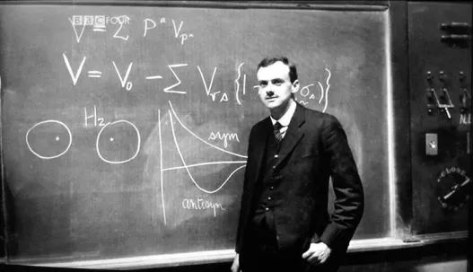
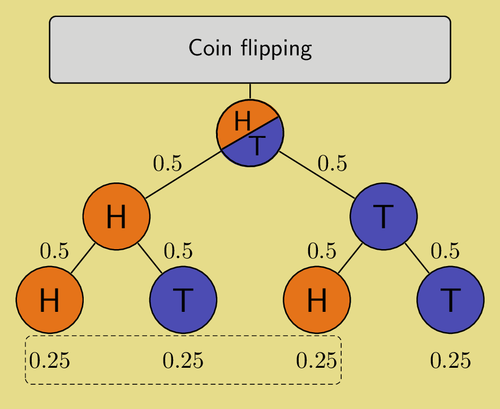
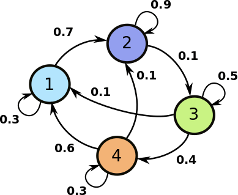
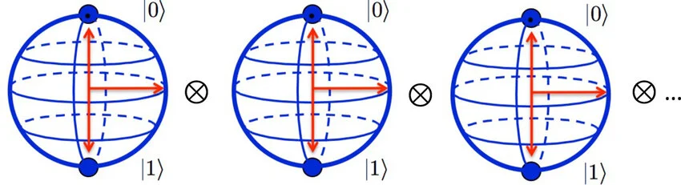
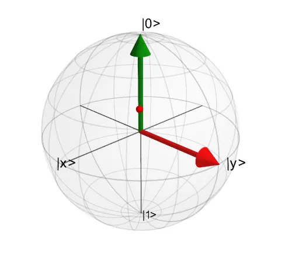
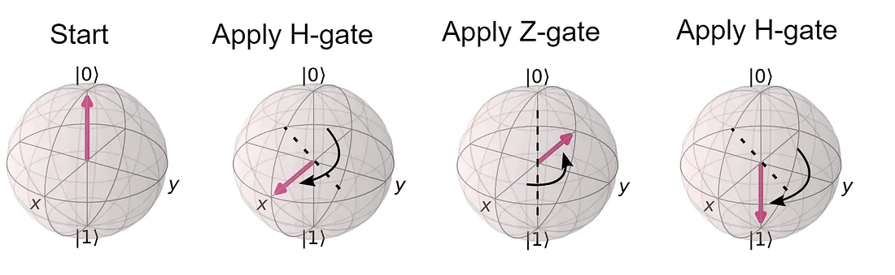

# Dia 2 — Fundamentos Matemáticos da Computação Quântica

> **Data:** 14 de julho de 2026  
> **Evento:** Qiskit Global Summer School 2026  
> **Tema da aula:** Estados clássicos, estados quânticos, operações e sistemas compostos

---

## Sobre estas anotações

Estas anotações foram produzidas a partir do conteúdo apresentado durante a live do **Qiskit Global Summer School 2026**, promovido pela IBM Quantum.

Ou seja, eu só reorganizei os conceitos e reescrevi de acordo com o que compreendi durante a apresentação.
---

---

## Resumo do Dia 2

Neste segundo dia, compreendi que:

- um sistema possui um conjunto de estados possíveis;
- estados probabilísticos podem ser representados por vetores;
- as probabilidades de um vetor clássico devem ser não negativas e somar \(1\);
- a Notação de Dirac é uma forma compacta de representar vetores;
- medir um sistema atualiza o nosso estado de conhecimento;
- operações clássicas podem ser representadas por matrizes;
- matrizes estocásticas descrevem transformações probabilísticas clássicas;
- sistemas compostos são descritos por produto cartesiano e produto tensorial;
- o espaço de estados cresce exponencialmente conforme adicionamos bits ou qubits;
- estados quânticos utilizam amplitudes complexas, e não probabilidades diretas;
- a Regra de Born transforma amplitudes em probabilidades;
- todo estado quântico válido deve ser normalizado;
- operações quânticas são representadas por matrizes unitárias;
- operações unitárias preservam a norma e são reversíveis;
- as portas \(I\), \(X\), \(Y\), \(Z\), \(H\) e \(P(\theta)\) são operações fundamentais de um qubit;
- dois qubits vivem em um espaço de quatro dimensões;
- a diferença central entre o modelo probabilístico clássico e o quântico está no uso de amplitudes complexas e interferência.

---

# Estados probabilísticos clássicos

## O que é um conjunto de estados?

O conjunto de estados representa todas as possibilidades que um sistema pode assumir.

Ele costuma ser indicado pela letra grega:

$$
\Sigma
$$

Se \(X\) for um bit clássico, ele pode estar apenas em um dos seguintes estados:

$$
\Sigma = \{0,1\}
$$

Ou seja:

```text
0 = bit desligado
1 = bit ligado
```

Esse conjunto não informa qual estado está ocorrendo naquele momento. Ele apenas lista todas as possibilidades permitidas para o sistema.

---

## O que é um estado probabilístico?

Um estado probabilístico é uma descrição matemática do nosso grau de certeza ou incerteza sobre a situação de um sistema.

Considere um bit físico que pode estar ligado ou desligado, mas que não podemos observar naquele momento.

Suponha que saibamos que:

- existe \(75\%\) de chance de ele estar em \(0\);
- existe \(25\%\) de chance de ele estar em \(1\).

Podemos representar essa distribuição por meio de um vetor coluna:

$$
\begin{pmatrix}
\text{Probabilidade de ser }0 \\
\text{Probabilidade de ser }1
\end{pmatrix}
=
\begin{pmatrix}
\frac{3}{4} \\
\frac{1}{4}
\end{pmatrix}
$$

Em porcentagens:

$$
\begin{pmatrix}
75\% \\
25\%
\end{pmatrix}
$$

A primeira posição representa a probabilidade do estado \(0\), e a segunda representa a probabilidade do estado \(1\).

---

## Regras de um vetor de probabilidades

Para que um vetor de probabilidades seja válido, duas condições precisam ser satisfeitas.

### 1. Nenhuma probabilidade pode ser negativa

Não existe uma probabilidade como:

```text
-10%
```

Portanto, cada valor deve satisfazer:

$$
p_k \geq 0
$$

### 2. A soma deve ser igual a \(1\)

A soma de todas as probabilidades deve representar \(100\%\):

$$
\frac{3}{4}+\frac{1}{4}=1
$$

De forma geral:

$$
\sum_k p_k = 1
$$

Se a soma fosse \(0{,}8\), faltariam possibilidades. Se fosse \(1{,}2\), haveria probabilidade excedente.

---

## Por que representar estados com vetores?

Na computação, transformações e operações são frequentemente representadas por matrizes.

Quando uma matriz atua sobre um vetor de estado, obtemos um novo vetor:

$$
\text{Matriz da operação}
\times
\text{Vetor do estado}
=
\text{Novo estado}
$$

Ou:

$$
M|\psi\rangle = |\psi'\rangle
$$

Essa representação permite estudar computação utilizando ferramentas da álgebra linear.

---


# O que é a Notação de Dirac?

A **Notação de Dirac**, também chamada de notação **Bra-Ket**, é uma maneira compacta de representar vetores e operações.

<p align="center">
  
</p>


Em vez de escrever vetores coluna completos o tempo todo, usamos símbolos como:

$$
|0\rangle
\quad\text{e}\quad
|1\rangle
$$

---

## O que é um ket?

Um **ket** representa um vetor coluna.

O estado \( |0\rangle \), lido como “ket zero”, é:

$$
|0\rangle =
\begin{pmatrix}
1 \\
0
\end{pmatrix}
$$

Isso significa que o sistema possui:

- \(100\%\) de probabilidade de estar em \(0\);
- \(0\%\) de probabilidade de estar em \(1\).

O estado \( |1\rangle \), lido como “ket um”, é:

$$
|1\rangle =
\begin{pmatrix}
0 \\
1
\end{pmatrix}
$$

Isso significa:

- \(0\%\) de probabilidade de estar em \(0\);
- \(100\%\) de probabilidade de estar em \(1\).

O vetor probabilístico:

$$
\begin{pmatrix}
\frac{3}{4} \\
\frac{1}{4}
\end{pmatrix}
$$

também pode ser escrito como:

$$
\frac{3}{4}|0\rangle
+
\frac{1}{4}|1\rangle
$$

---

## O que é um bra?

Um **bra** representa um vetor linha.

O bra correspondente ao ket $|0\rangle$ é:

$$
\langle 0|
=
\begin{pmatrix}
1 & 0
\end{pmatrix}
$$

O bra correspondente ao ket $|1\rangle$ é:

$$
\langle 1|
=
\begin{pmatrix}
0 & 1
\end{pmatrix}
$$

Matematicamente, o bra é obtido por meio da transposta conjugada do ket.

Para vetores reais, isso se parece apenas com transformar um vetor coluna em vetor linha.

Quando existem números complexos, também precisamos trocar o sinal da parte imaginária.

---

## Produto interno

Quando combinamos um bra e um ket:

$$
\langle \psi|\phi\rangle
$$

obtemos um número chamado **produto interno**.

Esse valor pode ser utilizado para:

- comparar estados;
- calcular sobreposições;
- verificar ortogonalidade;
- obter probabilidades de transição.

Por exemplo:

$$
\langle 0|1\rangle = 0
$$

Isso indica que \( |0\rangle \) e \( |1\rangle \) são estados ortogonais.

Já:

$$
\langle 0|0\rangle = 1
$$

---

## Produto externo

Quando colocamos um ket antes de um bra:

$$
|\psi\rangle\langle\phi|
$$

obtemos uma matriz.

Por exemplo:

$$
|1\rangle\langle0|
=
\begin{pmatrix}
0 \\
1
\end{pmatrix}
\begin{pmatrix}
1 & 0
\end{pmatrix}
=
\begin{pmatrix}
0 & 0 \\
1 & 0
\end{pmatrix}
$$

Esse tipo de construção é utilizado para formar operações a partir das relações entre entradas e saídas.

---

# Medição e atualização do estado

<p align="center">
  
</p>

<p align="center">
  <em>
    Árvore de probabilidades para dois lançamentos de uma moeda justa.
    Cada resultado individual possui probabilidade de 50%, enquanto cada
    sequência de dois resultados possui probabilidade de 25%.
    Fonte: TeXample.net.
  </em>
</p>

## O ato de medir

Quando levantamos a mão e observamos a moeda, po exemplo, realizamos uma medição.

A medição fornece uma informação clássica concreta:

```text
cara ou coroa
```

Se observarmos coroa, o vetor de probabilidades passa a ser:

$$
|\text{coroa}\rangle
=
\begin{pmatrix}
0 \\
1
\end{pmatrix}
$$

A incerteza anterior desaparece e o nosso estado de conhecimento é atualizado.

---

## Diferença para a medição quântica

No exemplo clássico, a moeda já possuía um lado definido antes da observação.

Na mecânica quântica, um estado em superposição não é apenas falta de informação sobre um valor escondido.

Quando medimos um qubit, o estado é projetado em um dos resultados possíveis da base de medição.

Depois da medição na base computacional, o estado passa a ser \( |0\rangle \) ou \( |1\rangle \).

---

# Operações clássicas com matrizes


## As quatro funções possíveis de um bit

Uma função clássica que recebe um único bit e devolve um único bit possui apenas quatro comportamentos possíveis.

### Função constante zero

$$
f_1(a)=0
$$

| Entrada | Saída |
|:---:|:---:|
| 0 | 0 |
| 1 | 0 |

### Função identidade

$$
f_2(a)=a
$$

| Entrada | Saída |
|:---:|:---:|
| 0 | 0 |
| 1 | 1 |

### Função NOT

$$
f_3(a)=\operatorname{NOT}(a)
$$

| Entrada | Saída |
|:---:|:---:|
| 0 | 1 |
| 1 | 0 |

### Função constante um

$$
f_4(a)=1
$$

| Entrada | Saída |
|:---:|:---:|
| 0 | 1 |
| 1 | 1 |

---

## A equação da transformação

Uma operação clássica pode ser escrita como:

$$
M|a\rangle = |f(a)\rangle
$$

Onde:

- \( |a\rangle \) é o estado de entrada;
- \(M\) é a matriz da operação;
- \( |f(a)\rangle \) é o estado de saída.

A matriz pode ser construída por:

$$
M=
\sum_{a\in\Sigma}
|f(a)\rangle\langle a|
$$

---

## Exemplo: construção da porta NOT

Para a função NOT:

```text
0 → 1
1 → 0
```

Temos:

$$
M_{\text{NOT}}
=
|1\rangle\langle0|
+
|0\rangle\langle1|
$$

Calculando os produtos externos:

$$
|1\rangle\langle0|
=
\begin{pmatrix}
0 & 0 \\
1 & 0
\end{pmatrix}
$$

$$
|0\rangle\langle1|
=
\begin{pmatrix}
0 & 1 \\
0 & 0
\end{pmatrix}
$$

Somando:

$$
M_{\text{NOT}}
=
\begin{pmatrix}
0 & 1 \\
1 & 0
\end{pmatrix}
$$

Essa matriz troca \( |0\rangle \) por \( |1\rangle \) e vice-versa.

---

## Matrizes das quatro operações

### Sempre zero

$$
M_1=
\begin{pmatrix}
1 & 1 \\
0 & 0
\end{pmatrix}
$$

### Identidade

$$
M_2=
\begin{pmatrix}
1 & 0 \\
0 & 1
\end{pmatrix}
$$

### NOT

$$
M_3=
\begin{pmatrix}
0 & 1 \\
1 & 0
\end{pmatrix}
$$

### Sempre um

$$
M_4=
\begin{pmatrix}
0 & 0 \\
1 & 1
\end{pmatrix}
$$

As operações constante zero e constante um apagam informação sobre a entrada e, por isso, não são reversíveis.

---

# Operações probabilísticas clássicas


## O que é uma matriz estocástica?

<p align="center">
  
</p>

<p align="center">
  <em>
    Exemplo de um sistema probabilístico com quatro estados.
    Cada seta representa a probabilidade de transição entre os estados.
  </em>
</p>

Uma matriz estocástica descreve transformações probabilísticas clássicas.

Para que seja válida:

- nenhum elemento pode ser negativo;
- a soma dos elementos de cada coluna deve ser igual a \(1\).

Cada coluna representa a distribuição de saída associada a uma entrada específica.

---

## Exemplo de matriz estocástica

Considere:

$$
M=
\begin{pmatrix}
1 & \frac{1}{2} \\
0 & \frac{1}{2}
\end{pmatrix}
$$

### Entrada $|0\rangle$

A primeira coluna é:

$$
\begin{pmatrix}
1 \\
0
\end{pmatrix}
$$

Portanto, se entrar \(0\), o resultado continuará sendo \(0\) com certeza.

### Entrada $|1\rangle$

A segunda coluna é:

$$
\begin{pmatrix}
\frac{1}{2} \\
\frac{1}{2}
\end{pmatrix}
$$

Portanto, se entrar \(1\):

- há \(50\%\) de chance de a saída ser \(0\);
- há \(50\%\) de chance de a saída ser \(1\).

---

## Mistura de operações determinísticas

A matriz anterior pode ser escrita como:

$$
M=
\frac{1}{2}
\begin{pmatrix}
1 & 0 \\
0 & 1
\end{pmatrix}
+
\frac{1}{2}
\begin{pmatrix}
1 & 1 \\
0 & 0
\end{pmatrix}
$$

Isso significa que podemos interpretá-la como:

1. sortear entre duas operações com a mesma probabilidade;
2. em metade das vezes, aplicar a identidade;
3. na outra metade, aplicar a função constante zero.

Assim, uma operação probabilística clássica pode ser compreendida como uma mistura estatística de operações determinísticas.

---

# Sistemas compostos


<p align="center">
  
</p>

<p align="center">
  <em>
    O espaço de Hilbert de um sistema com vários qubits é formado pelo
    produto tensorial dos espaços de cada qubit individual.
    Para $n$ qubits, o espaço composto possui dimensão $2^n$.
    Fonte: Joseph et al. (2023).
  </em>
</p>
## Produto cartesiano

Para representar dois sistemas juntos, primeiro combinamos seus conjuntos de estados.

Suponha:

$$
\Sigma=\{0,1\}
$$

e:

$$
\Gamma=\{0,1\}
$$

O produto cartesiano é:

$$
\Sigma\times\Gamma
=
\{(0,0),(0,1),(1,0),(1,1)\}
$$

Em computação, normalmente escrevemos as combinações como bitstrings:

$$
\Sigma\times\Gamma
=
\{00,01,10,11\}
$$

---

## Crescimento do número de estados

A quantidade de combinações possíveis cresce exponencialmente.

| Quantidade de bits | Estados possíveis |
|:---:|:---:|
| 1 | \(2^1=2\) |
| 2 | \(2^2=4\) |
| 3 | \(2^3=8\) |
| 10 | \(2^{10}=1024\) |
| \(n\) | \(2^n\) |

Cada bit adicional dobra o número de estados possíveis.

---

## Produto tensorial

O produto cartesiano combina conjuntos de possibilidades.

O **produto tensorial** combina os vetores matemáticos que representam os sistemas.

Ele é indicado por:

$$
\otimes
$$

Considere dois estados:

$$
|\phi\rangle
=
\frac{3}{4}|0\rangle
+
\frac{1}{4}|1\rangle
$$

e:

$$
|\psi\rangle
=
\frac{1}{2}|0\rangle
+
\frac{1}{2}|1\rangle
$$

O estado conjunto é:

$$
|\phi\rangle\otimes|\psi\rangle
$$

Multiplicamos cada coeficiente do primeiro estado por cada coeficiente do segundo:

$$
|\phi\rangle\otimes|\psi\rangle
=
\frac{3}{8}|00\rangle
+
\frac{3}{8}|01\rangle
+
\frac{1}{8}|10\rangle
+
\frac{1}{8}|11\rangle
$$

Na forma vetorial:

$$
\begin{pmatrix}
\frac{3}{8} \\
\frac{3}{8} \\
\frac{1}{8} \\
\frac{1}{8}
\end{pmatrix}
$$

A soma continua igual a \(1\):

$$
\frac{3}{8}
+
\frac{3}{8}
+
\frac{1}{8}
+
\frac{1}{8}
=
1
$$

---

## Omissão do símbolo de produto tensorial

É comum omitir o símbolo \(\otimes\).

Assim:

$$
|\phi\rangle\otimes|\psi\rangle
$$

pode ser escrito como:

$$
|\phi\rangle|\psi\rangle
$$

ou, dependendo do contexto:

$$
|\phi\psi\rangle
$$

Por exemplo:

$$
|0\rangle\otimes|1\rangle
=
|01\rangle
$$

---

## Bilinearidade

O produto tensorial é bilinear.

Isso significa que ele distribui sobre somas nos dois lados.

### Distribuição no primeiro estado

$$
\left(
|\phi_1\rangle+|\phi_2\rangle
\right)
\otimes|\psi\rangle
=
|\phi_1\rangle\otimes|\psi\rangle
+
|\phi_2\rangle\otimes|\psi\rangle
$$

### Distribuição no segundo estado

$$
|\phi\rangle\otimes
\left(
|\psi_1\rangle+|\psi_2\rangle
\right)
=
|\phi\rangle\otimes|\psi_1\rangle
+
|\phi\rangle\otimes|\psi_2\rangle
$$

### Multiplicação por escalares

$$
(\alpha|\phi\rangle)\otimes|\psi\rangle
=
\alpha
\left(
|\phi\rangle\otimes|\psi\rangle
\right)
$$

$$
|\phi\rangle\otimes(\alpha|\psi\rangle)
=
\alpha
\left(
|\phi\rangle\otimes|\psi\rangle
\right)
$$

---

## Exemplo de bilinearidade

Considere:

$$
\left(
\frac{1}{2}|0\rangle
+
\frac{1}{2}|1\rangle
\right)
\otimes|1\rangle
$$

Aplicando a distribuição:

$$
\frac{1}{2}|0\rangle\otimes|1\rangle
+
\frac{1}{2}|1\rangle\otimes|1\rangle
$$

Logo:

$$
\frac{1}{2}|01\rangle
+
\frac{1}{2}|11\rangle
$$

---

## Produto tensorial de matrizes

O produto tensorial também pode combinar matrizes.

Considere:

$$
A=
\begin{pmatrix}
a & b \\
c & d
\end{pmatrix}
$$

e:

$$
B=
\begin{pmatrix}
x & y \\
z & w
\end{pmatrix}
$$

Então:

$$
A\otimes B
=
\begin{pmatrix}
aB & bB \\
cB & dB
\end{pmatrix}
$$

Expandindo:

$$
A\otimes B
=
\begin{pmatrix}
ax & ay & bx & by \\
az & aw & bz & bw \\
cx & cy & dx & dy \\
cz & cw & dz & dw
\end{pmatrix}
$$

Se $A$ e $B$ são matrizes $2 \times 2$, o resultado será uma matriz $4 \times 4$.
---

## Operações em vários qubits

Se temos dois qubits e desejamos aplicar:

- a porta \(H\) no primeiro;
- a porta \(X\) no segundo;

a operação conjunta é:

$$
H\otimes X
$$

Essa matriz atua no vetor global de quatro posições do sistema de dois qubits.


---

# Crescimento exponencial e amostragem clássica

## O problema da representação completa

Para \(n\) bits, um vetor completo de probabilidades possui:

$$
2^n
$$

posições.

Para \(10\) bits:

$$
2^{10}=1024
$$

Para \(500\) bits:

$$
2^{500}
$$

Esse número possui aproximadamente \(151\) algarismos e é muito maior que o número estimado de átomos no universo observável.

Portanto, armazenar explicitamente uma distribuição arbitrária com \(2^{500}\) probabilidades é fisicamente inviável.

---

## Como computadores clássicos lidam com isso?

Computadores clássicos normalmente não armazenam todas as probabilidades possíveis.

Quando o estado é determinístico, basta guardar uma única bitstring:

```text
0100110101...
```

Quando existe aleatoriedade, uma alternativa é utilizar **amostragem**.

Em vez de calcular toda a distribuição, o programa sorteia resultados individuais várias vezes.

---

## Exemplo em Python

```python
import random

n_bits = 500

bits = random.getrandbits(n_bits)

print(format(bits, f"0{n_bits}b"))
```

Esse código gera uma única bitstring aleatória de \(500\) bits.

Ele não cria um vetor com \(2^{500}\) posições.

---

## Limites da amostragem

A amostragem clássica é eficiente quando conseguimos gerar cada amostra sem precisar construir a distribuição completa.

Porém, nem toda distribuição complexa pode ser amostrada eficientemente por um computador clássico.

Em sistemas quânticos, as amplitudes apresentam fases e interferência. Simular exatamente a evolução de um estado quântico arbitrário pode exigir recursos que crescem exponencialmente.

> Um computador quântico não armazena explicitamente uma tabela clássica com todas as amplitudes. O próprio estado físico dos qubits evolui de acordo com as leis quânticas. A vantagem computacional depende de algoritmos capazes de explorar essa evolução e produzir resultados úteis por meio da medição.

---

# Estados quânticos

<p align="center">
  
</p>

<p align="center">
  <em>
    Representação de um estado de qubit na Esfera de Bloch.
    Os polos correspondem aos estados $|0\rangle$ e $|1\rangle$,
    enquanto outros pontos da esfera representam superposições.
    Fonte: QuTiP.
  </em>
</p>

## Da probabilidade clássica para a amplitude quântica

Um qubit medido na base computacional continua produzindo:

$$
0
\quad\text{ou}\quad
1
$$

Porém, antes da medição, o estado quântico é descrito por amplitudes complexas:

$$
|\psi\rangle
=
\alpha|0\rangle
+
\beta|1\rangle
$$

Onde:

$$
\alpha,\beta\in\mathbb{C}
$$

Os valores \(\alpha\) e \(\beta\) não são probabilidades diretamente.

Eles são **amplitudes de probabilidade**.

---

## Regra de Born

As probabilidades de medição são obtidas pelo módulo ao quadrado das amplitudes:

$$
P(0)=|\alpha|^2
$$

$$
P(1)=|\beta|^2
$$

A condição de normalização é:

$$
|\alpha|^2+|\beta|^2=1
$$

---

## Exemplo: estado $|+\rangle$

O estado:

$$
|+\rangle
=
\frac{1}{\sqrt{2}}|0\rangle
+
\frac{1}{\sqrt{2}}|1\rangle
$$

possui as probabilidades:

$$
P(0)
=
\left|
\frac{1}{\sqrt{2}}
\right|^2
=
\frac{1}{2}
$$

$$
P(1)
=
\left|
\frac{1}{\sqrt{2}}
\right|^2
=
\frac{1}{2}
$$

Portanto:

```text
50% de chance de medir 0
50% de chance de medir 1
```

---

## Exemplo com amplitudes complexas

Considere:

$$
|\psi\rangle
=
\frac{1+2i}{3}|0\rangle
-
\frac{2}{3}|1\rangle
$$

A probabilidade de medir \(0\) é:

$$
P(0)
=
\left|
\frac{1+2i}{3}
\right|^2
$$

Como:

$$
|1+2i|^2
=
1^2+2^2
=
5
$$

temos:

$$
P(0)=\frac{5}{9}
$$

A probabilidade de medir \(1\) é:

$$
P(1)
=
\left|
-\frac{2}{3}
\right|^2
=
\frac{4}{9}
$$

Verificando:

$$
\frac{5}{9}
+
\frac{4}{9}
=
1
$$

---

## Por que usar números complexos?

Números complexos possuem magnitude e fase.

A fase permite que amplitudes associadas a diferentes caminhos de um cálculo:

- reforcem umas às outras;
- cancelem umas às outras;
- produzam interferência construtiva;
- produzam interferência destrutiva.

Probabilidades clássicas são não negativas e não possuem fase. Por isso, elas não interferem da mesma maneira que amplitudes quânticas.

---

# Norma Euclidiana e normalização

## O que é a norma de um vetor?

A norma representa o comprimento de um vetor.

Para um estado:

$$
|\psi\rangle
=
\begin{pmatrix}
\alpha_1 \\
\alpha_2 \\
\vdots \\
\alpha_N
\end{pmatrix}
$$

a norma euclidiana é:

$$
\left\|
|\psi\rangle
\right\|
=
\sqrt{
\sum_{k=1}^{N}
|\alpha_k|^2
}
$$

---

## Estado quântico válido

Todo estado quântico válido precisa possuir norma igual a \(1\):

$$
\left\|
|\psi\rangle
\right\|
=
1
$$

Elevando os dois lados ao quadrado:

$$
\sum_{k=1}^{N}
|\alpha_k|^2
=
1
$$

Essa é exatamente a condição de normalização das probabilidades de medição.

---

## Interpretação geométrica

Um estado quântico normalizado pode ser imaginado como uma seta de comprimento \(1\).

As operações quânticas podem alterar a direção dessa seta, mas não podem alterar seu comprimento.

No caso de um qubit puro, essa interpretação está relacionada à **Esfera de Bloch**.

> A Esfera de Bloch representa estados puros de um qubit, desconsiderando diferenças de fase global.

---

# Operações quânticas

## Matrizes unitárias

Operações quânticas fechadas são representadas por matrizes unitárias.

Uma matriz \(U\) é unitária quando:

$$
U^\dagger U=I
$$

Onde:

- \(U^\dagger\) é a transposta conjugada de \(U\);
- \(I\) é a matriz identidade.

---

## Preservação da norma

Uma operação unitária preserva a norma do estado:

$$
\left\|
U|\psi\rangle
\right\|
=
\left\|
|\psi\rangle
\right\|
$$

Isso garante que um estado normalizado continue normalizado depois da aplicação de uma porta quântica.

---

## Reversibilidade

Da relação:

$$
U^\dagger U=I
$$

concluímos que:

$$
U^{-1}=U^\dagger
$$

Portanto, toda operação unitária possui uma inversa.

Se aplicarmos \(U\) e depois \(U^\dagger\):

$$
U^\dagger U|\psi\rangle
=
I|\psi\rangle
=
|\psi\rangle
$$

O sistema retorna ao estado inicial.

> A evolução unitária é reversível. A medição, por outro lado, não é descrita apenas por uma operação unitária sobre o sistema medido e produz uma atualização não reversível do estado observado.

---

<p align="center">
  
</p>

<p align="center">
  <em>
    Evolução do estado de um qubit na Esfera de Bloch após a aplicação
    sequencial das portas $H$, $Z$ e $H$. O estado inicial $|0\rangle$
    é transformado no estado final $|1\rangle$.
    Fonte: Qiskit.
  </em>
</p>

# Portas fundamentais de um qubit

## Porta Identidade

A porta identidade não altera o estado:

$$
I=
\begin{pmatrix}
1 & 0 \\
0 & 1
\end{pmatrix}
$$

Logo:

$$
I|\psi\rangle=|\psi\rangle
$$

---

## Porta Pauli-X

A porta \(X\) é o equivalente quântico da operação NOT:

$$
X=
\begin{pmatrix}
0 & 1 \\
1 & 0
\end{pmatrix}
$$

Ela realiza:

$$
X|0\rangle=|1\rangle
$$

$$
X|1\rangle=|0\rangle
$$

Na Esfera de Bloch, corresponde a uma rotação de \(180^\circ\) em torno do eixo \(X\), desconsiderando uma fase global.

---

## Porta Pauli-Y

A porta \(Y\) é:

$$
Y=
\begin{pmatrix}
0 & -i \\
i & 0
\end{pmatrix}
$$

Ela atua como:

$$
Y|0\rangle=i|1\rangle
$$

$$
Y|1\rangle=-i|0\rangle
$$

Ela combina uma troca entre \( |0\rangle \) e \( |1\rangle \) com mudanças de fase.

---

## Porta Pauli-Z

A porta \(Z\) é:

$$
Z=
\begin{pmatrix}
1 & 0 \\
0 & -1
\end{pmatrix}
$$

Ela realiza:

$$
Z|0\rangle=|0\rangle
$$

$$
Z|1\rangle=-|1\rangle
$$

A porta \(Z\) não troca as probabilidades de \(0\) e \(1\), mas altera a fase relativa.

---

## Porta Hadamard

A porta Hadamard é:

$$
H=
\frac{1}{\sqrt{2}}
\begin{pmatrix}
1 & 1 \\
1 & -1
\end{pmatrix}
$$

Aplicada a \( |0\rangle \):

$$
H|0\rangle
=
\frac{|0\rangle+|1\rangle}{\sqrt{2}}
=
|+\rangle
$$

Aplicada a \( |1\rangle \):

$$
H|1\rangle
=
\frac{|0\rangle-|1\rangle}{\sqrt{2}}
=
|-\rangle
$$

A Hadamard é muito utilizada para criar superposições e produzir interferência.

Também vale:

$$
H^2=I
$$

Portanto, aplicar \(H\) duas vezes retorna o estado original.

---

## Porta de fase

A porta de fase pode ser escrita como:

$$
P(\theta)
=
\begin{pmatrix}
1 & 0 \\
0 & e^{i\theta}
\end{pmatrix}
$$

Ela deixa \( |0\rangle \) inalterado:

$$
P(\theta)|0\rangle=|0\rangle
$$

E adiciona uma fase ao estado \( |1\rangle \):

$$
P(\theta)|1\rangle=e^{i\theta}|1\rangle
$$

Para um estado geral:

$$
|\psi\rangle
=
\alpha|0\rangle+\beta|1\rangle
$$

temos:

$$
P(\theta)|\psi\rangle
=
\alpha|0\rangle
+
e^{i\theta}\beta|1\rangle
$$

A probabilidade de medir \(0\) ou \(1\) pode permanecer igual imediatamente após a porta, mas a mudança de fase pode afetar resultados futuros quando houver interferência.

---

# Dois qubits

## Espaço de Hilbert de dois qubits

Um único qubit vive em:

$$
\mathbb{C}^2
$$

Dois qubits vivem no produto tensorial:

$$
\mathbb{C}^2
\otimes
\mathbb{C}^2
\cong
\mathbb{C}^4
$$

Isso significa que o estado global possui quatro amplitudes.

---

## Forma geral de um estado de dois qubits

Um estado geral pode ser escrito como:

$$
|\psi\rangle
=
\alpha_{00}|00\rangle
+
\alpha_{01}|01\rangle
+
\alpha_{10}|10\rangle
+
\alpha_{11}|11\rangle
$$

Na forma vetorial:

$$
|\psi\rangle
=
\begin{pmatrix}
\alpha_{00} \\
\alpha_{01} \\
\alpha_{10} \\
\alpha_{11}
\end{pmatrix}
$$

A condição de normalização é:

$$
|\alpha_{00}|^2
+
|\alpha_{01}|^2
+
|\alpha_{10}|^2
+
|\alpha_{11}|^2
=
1
$$

---

## Exemplo de superposição uniforme

Considere:

$$
|\psi\rangle
=
\frac{1}{2}|00\rangle
+
\frac{1}{2}|01\rangle
+
\frac{1}{2}|10\rangle
+
\frac{1}{2}|11\rangle
$$

Na forma vetorial:

$$
|\psi\rangle
=
\begin{pmatrix}
\frac{1}{2} \\
\frac{1}{2} \\
\frac{1}{2} \\
\frac{1}{2}
\end{pmatrix}
$$

Cada resultado possui probabilidade:

$$
\left|
\frac{1}{2}
\right|^2
=
\frac{1}{4}
$$

Portanto:

| Resultado | Probabilidade |
|:---:|:---:|
| \(00\) | \(25\%\) |
| \(01\) | \(25\%\) |
| \(10\) | \(25\%\) |
| \(11\) | \(25\%\) |

---

## Estados separáveis e emaranhados

Nem todo estado de dois qubits pode ser escrito como produto tensorial de dois estados individuais.

Quando podemos escrever:

$$
|\psi\rangle
=
|\phi\rangle\otimes|\chi\rangle
$$

o estado é chamado de **separável**.

Quando isso não é possível, o estado é **emaranhado**.

Um exemplo é:

$$
|\Phi^+\rangle
=
\frac{|00\rangle+|11\rangle}{\sqrt{2}}
$$

Esse estado não pode ser decomposto como produto de dois estados individuais de um qubit.

---

# Comparação entre computação clássica e quântica

| Conceito | Modelo clássico probabilístico | Modelo quântico |
|---|---|---|
| Estado | Vetor de probabilidades | Vetor de amplitudes |
| Valores | Números reais não negativos | Números complexos |
| Normalização | $\sum_k p_k = 1$ | $\sum_k \lvert\alpha_k\rvert^2 = 1$ |
| Probabilidade de resultado | Já está no vetor | Obtida pela Regra de Born |
| Operações | Matrizes estocásticas | Matrizes unitárias |
| Reversibilidade | Nem sempre reversível | Evolução unitária reversível |
| Sistemas compostos | Produto tensorial | Produto tensorial |
| Crescimento do espaço | $2^n$ | $2^n$ |
| Interferência | Não ocorre entre probabilidades | Ocorre entre amplitudes |
| Fase | Não faz parte da probabilidade | Influencia a interferência |

---

## A principal diferença

A computação quântica não abandona a teoria de probabilidades.

Ela utiliza uma estrutura mais ampla:

```text
Probabilidades clássicas
        ↓
Amplitudes complexas
        ↓
Interferência
        ↓
Probabilidades de medição
```

No modelo clássico, somamos probabilidades.

No modelo quântico, primeiro combinamos amplitudes complexas e, apenas no momento da medição, convertemos essas amplitudes em probabilidades utilizando a Regra de Born.

Essa diferença permite a existência de fenômenos como:

- superposição;
- interferência;
- emaranhamento;
- algoritmos quânticos com comportamentos difíceis de simular classicamente.

---

## Conclusão


A principal ideia é que estados quânticos são vetores normalizados de amplitudes complexas, e as operações válidas sobre esses estados são transformações unitárias.

Ao combinar vários qubits, o espaço de estados cresce exponencialmente. Essa estrutura permite representar interferências e correlações que não aparecem em uma distribuição clássica comum.

---

<p align="center">
  <a href="../README.md">Voltar para a página inicial</a>
</p>