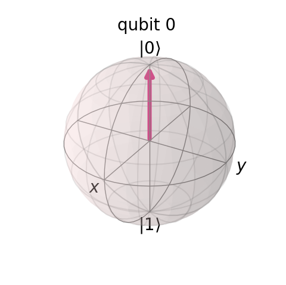
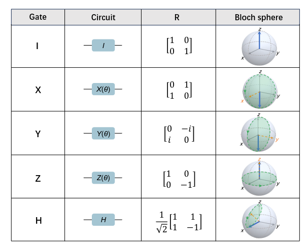
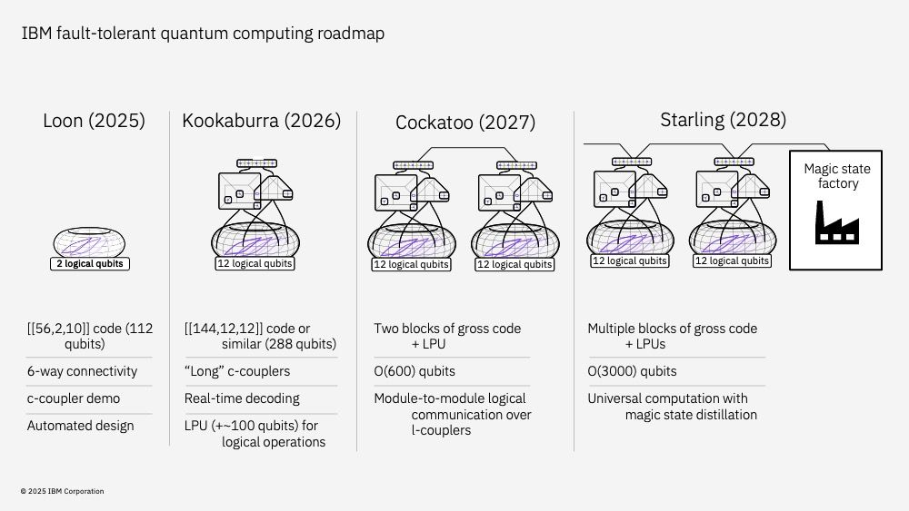

# Dia 3 — Programação Quântica

> **Data:** 15 de julho de 2026  
> **Evento:** Qiskit Global Summer School 2026  
> **Tema da aula:** Esfera de Bloch, portas quânticas, conjuntos universais, ruído e circuitos

---

## Sobre estas anotações

Estas anotações foram produzidas a partir do conteúdo apresentado durante a live do **Qiskit Global Summer School 2026**, promovido pela IBM Quantum.

Ou seja, eu só reorganizei os conceitos e reescrevi de acordo com o que compreendi durante a apresentação.
---

---

## Resumo do Dia 3

Neste terceiro dia, compreendi que:

- a Esfera de Bloch permite visualizar o estado de um qubit;
- os estados $|0\rangle$ e $|1\rangle$ ficam nos polos da esfera;
- superposições são representadas por outros pontos da superfície;
- os ângulos $\theta$ e $\phi$ descrevem a posição do qubit;
- portas quânticas podem ser interpretadas como rotações na Esfera de Bloch;
- as portas $X$, $Y$ e $Z$ realizam rotações de $180^\circ$;
- a porta Hadamard cria superposições equilibradas;
- as portas $S$ e $T$ realizam rotações de fase;
- portas de dois qubits permitem criar correlações e emaranhamento;
- a porta CX inverte o alvo quando o controle está em $1$;
- a porta CZ altera a fase quando os dois qubits estão em $1$;
- um conjunto universal permite construir qualquer operação quântica;
- circuitos formados apenas por portas Clifford podem ser simulados eficientemente em casos importantes;
- a porta $T$ é uma operação não-Clifford;
- computadores quânticos atuais possuem ruído, decoerência e erros de portas;
- portas de dois qubits normalmente são mais ruidosas que portas de um qubit;
- circuitos rasos são mais adequados para o hardware quântico atual;
- uma porta SWAP pode ser construída com três portas CNOT.

---

# Esfera de Bloch

## O que é a Esfera de Bloch?

<p align="center">
  
</p>

<p align="center">
  <em>
    Representação de um qubit na Esfera de Bloch. 
  </em>
</p>

A **Esfera de Bloch** é uma representação geométrica utilizada para visualizar o estado de um único qubit.

Um bit clássico pode assumir apenas dois valores:

```text
0 ou 1
```

Um qubit pode estar em uma superposição:

$$
|\psi\rangle
=
\alpha|0\rangle
+
\beta|1\rangle
$$

com:

$$
|\alpha|^2+|\beta|^2=1
$$

A esfera funciona como um mapa tridimensional do estado do qubit.

---

## Polos da esfera

Na Esfera de Bloch:

- o polo norte representa o estado \( |0\rangle \);
- o polo sul representa o estado \( |1\rangle \);
- os demais pontos representam superposições entre \( |0\rangle \) e \( |1\rangle \).

Se o estado estiver próximo do polo norte, a probabilidade de medir \(0\) será maior.

Se estiver próximo do polo sul, a probabilidade de medir \(1\) será maior.

No equador, os estados possuem probabilidades iguais de medição na base computacional, embora possam apresentar fases diferentes.

---

## Representação pelos ângulos

Um estado puro de um qubit pode ser escrito como:

$$
|\psi\rangle
=
\cos\left(\frac{\theta}{2}\right)|0\rangle
+
e^{i\phi}
\sin\left(\frac{\theta}{2}\right)|1\rangle
$$

Os ângulos funcionam como coordenadas geográficas:

- \(\theta\) indica a posição entre os polos norte e sul;
- \(\phi\) indica a posição ao redor do eixo vertical e representa a fase relativa.

Assim, \(\theta\) pode ser comparado à latitude e \(\phi\) à longitude.

---

## Interpretação das probabilidades

A probabilidade de medir \(0\) é:

$$
P(0)
=
\cos^2\left(\frac{\theta}{2}\right)
$$

A probabilidade de medir \(1\) é:

$$
P(1)
=
\sin^2\left(\frac{\theta}{2}\right)
$$

O ângulo \(\phi\) não altera imediatamente essas probabilidades quando medimos na base computacional.

Porém, ele influencia resultados posteriores quando o circuito produz interferência.

---


# Portas quânticas de um qubit

<p align="center">
  
</p>

<p align="center">
  <em>
    Representação das portas de um qubit $I$, $X$, $Y$, $Z$ e $H$,
    com seus símbolos de circuito, matrizes e efeitos na Esfera de Bloch.
    Fonte: Yao e Xiang (2024).
  </em>
</p>

## Portas como rotações

As portas quânticas modificam o estado do qubit.

Na Esfera de Bloch, muitas dessas operações podem ser interpretadas como rotações em torno dos eixos:

```text
X
Y
Z
```

Matematicamente, cada porta é representada por uma matriz unitária.

---

## Porta Pauli-X

A porta Pauli-X é:

$$
X=
\begin{pmatrix}
0 & 1 \\
1 & 0
\end{pmatrix}
$$

Ela troca os estados da base computacional:

$$
X|0\rangle=|1\rangle
$$

$$
X|1\rangle=|0\rangle
$$

Na Esfera de Bloch, corresponde a uma rotação de \(180^\circ\) em torno do eixo \(X\).

Ela é semelhante à porta NOT da computação clássica.

---

## Porta Pauli-Z

A porta Pauli-Z é:

$$
Z=
\begin{pmatrix}
1 & 0 \\
0 & -1
\end{pmatrix}
$$

Ela mantém \( |0\rangle \) inalterado:

$$
Z|0\rangle=|0\rangle
$$

E altera o sinal do estado \( |1\rangle \):

$$
Z|1\rangle=-|1\rangle
$$

A porta \(Z\) não troca diretamente as probabilidades de medir \(0\) ou \(1\).

Ela modifica a fase relativa do estado.

Por exemplo:

$$
Z|+\rangle=|-\rangle
$$

Na Esfera de Bloch, ela representa uma rotação de \(180^\circ\) em torno do eixo \(Z\).

---

## Porta Pauli-Y

A porta Pauli-Y é:

$$
Y=
\begin{pmatrix}
0 & -i \\
i & 0
\end{pmatrix}
$$

Ela atua como:

$$
Y|0\rangle=i|1\rangle
$$

$$
Y|1\rangle=-i|0\rangle
$$

A porta \(Y\) altera tanto o estado da base computacional quanto a fase.

Na Esfera de Bloch, corresponde a uma rotação de \(180^\circ\) em torno do eixo \(Y\).

---

## Porta Hadamard

A porta Hadamard é:

$$
H=
\frac{1}{\sqrt{2}}
\begin{pmatrix}
1 & 1 \\
1 & -1
\end{pmatrix}
$$

Aplicada ao estado \( |0\rangle \):

$$
H|0\rangle
=
\frac{|0\rangle+|1\rangle}{\sqrt{2}}
=
|+\rangle
$$

Aplicada ao estado \( |1\rangle \):

$$
H|1\rangle
=
\frac{|0\rangle-|1\rangle}{\sqrt{2}}
=
|-\rangle
$$

Nos dois casos, as probabilidades de medição são:

$$
P(0)=\frac{1}{2}
$$

$$
P(1)=\frac{1}{2}
$$

A Hadamard é frequentemente utilizada para criar uma superposição equilibrada.

---

## Porta S

A porta \(S\) é:

$$
S=
\begin{pmatrix}
1 & 0 \\
0 & i
\end{pmatrix}
$$

Ela realiza uma rotação de fase de:

$$
90^\circ
$$

ou:

$$
\frac{\pi}{2}
$$

Ela deixa \( |0\rangle \) inalterado e multiplica o componente \( |1\rangle \) por \(i\).

Também vale:

$$
S^2=Z
$$

---

## Porta T

A porta \(T\) é:

$$
T=
\begin{pmatrix}
1 & 0 \\
0 & e^{i\pi/4}
\end{pmatrix}
$$

Ela realiza uma rotação de fase de:

$$
45^\circ
$$

ou:

$$
\frac{\pi}{4}
$$

A porta \(T\) é importante porque não pertence ao grupo de Clifford.

---

## Resumo das portas de um qubit

| Porta | Operação principal | Interpretação |
|:---:|---|---|
| \(X\) | Inversão de bit | Troca \( |0\rangle \) e \( |1\rangle \) |
| \(Y\) | Inversão com fase | Rotação em torno do eixo \(Y\) |
| \(Z\) | Inversão de fase | Altera o sinal do componente \( |1\rangle \) |
| \(H\) | Criação de superposição | Produz os estados \( |+\rangle \) e \( |-\rangle \) |
| \(S\) | Rotação de fase de \(90^\circ\) | Ajuste de fase |
| \(T\) | Rotação de fase de \(45^\circ\) | Operação não-Clifford |

---

# Portas quânticas de dois qubits


## Interação entre qubits

Portas de um qubit modificam apenas um sistema quântico.

Portas de dois qubits permitem que o comportamento de um qubit dependa do estado de outro.

Essas operações são fundamentais para criar:

- correlações quânticas;
- emaranhamento;
- circuitos quânticos mais complexos.

---

## Porta CX ou CNOT

A porta CX, também chamada de CNOT, possui:

- um qubit de controle;
- um qubit alvo.

A regra é:

> Se o qubit de controle estiver no estado \(1\), o qubit alvo será invertido.

As transformações são:

$$
|00\rangle\rightarrow|00\rangle
$$

$$
|01\rangle\rightarrow|01\rangle
$$

$$
|10\rangle\rightarrow|11\rangle
$$

$$
|11\rangle\rightarrow|10\rangle
$$

Sua matriz é:

$$
CX=
\begin{pmatrix}
1 & 0 & 0 & 0 \\
0 & 1 & 0 & 0 \\
0 & 0 & 0 & 1 \\
0 & 0 & 1 & 0
\end{pmatrix}
$$

---

## Controle e alvo

Em um circuito quântico, a porta CX costuma ser desenhada com:

- um ponto no qubit de controle;
- um símbolo de soma no qubit alvo.

Em Qiskit:

```python
qc.cx(controle, alvo)
```

Por exemplo:

```python
qc.cx(0, 1)
```

significa:

```text
q0 = controle
q1 = alvo
```

---

## Criação de emaranhamento

Considere dois qubits inicialmente no estado:

$$
|00\rangle
$$

Aplicamos uma porta Hadamard no primeiro qubit:

$$
|00\rangle
\xrightarrow{H\otimes I}
\frac{|00\rangle+|10\rangle}{\sqrt{2}}
$$

Depois, aplicamos uma CNOT:

$$
\frac{|00\rangle+|10\rangle}{\sqrt{2}}
\xrightarrow{CX}
\frac{|00\rangle+|11\rangle}{\sqrt{2}}
$$

O estado final é:

$$
|\Phi^+\rangle
=
\frac{|00\rangle+|11\rangle}{\sqrt{2}}
$$

Esse é um estado de Bell emaranhado.

Ao medir:

- se o primeiro qubit for \(0\), o segundo também será \(0\);
- se o primeiro qubit for \(1\), o segundo também será \(1\).

---

## Porta CZ

A porta Controlled-Z modifica a fase apenas quando os dois qubits estão no estado \(1\).

As transformações são:

$$
|00\rangle\rightarrow|00\rangle
$$

$$
|01\rangle\rightarrow|01\rangle
$$

$$
|10\rangle\rightarrow|10\rangle
$$

$$
|11\rangle\rightarrow-|11\rangle
$$

Sua matriz é:

$$
CZ=
\begin{pmatrix}
1 & 0 & 0 & 0 \\
0 & 1 & 0 & 0 \\
0 & 0 & 1 & 0 \\
0 & 0 & 0 & -1
\end{pmatrix}
$$

A porta CZ é simétrica.

Diferentemente da CX, a distinção entre controle e alvo não altera o resultado lógico da operação.

---

# Conjuntos universais de portas

## O que é um conjunto universal?

Um **conjunto universal de portas** é um grupo pequeno de operações capaz de construir ou aproximar qualquer operação quântica.

A ideia pode ser comparada a peças de LEGO.

Com um conjunto básico de peças, é possível construir estruturas diferentes e complexas.

Na computação quântica, uma combinação universal conhecida é:

$$
\{H,T,CX\}
$$

Isso significa que qualquer circuito quântico pode ser decomposto ou aproximado utilizando sequências dessas portas.

---

## Portas de um e dois qubits

De forma geral, qualquer operação quântica pode ser construída utilizando:

- operações de um qubit;
- pelo menos uma operação capaz de criar interação entre dois qubits.

As portas de um qubit realizam rotações locais.

As portas de dois qubits permitem criar correlações e emaranhamento.

---

# Grupo de Clifford

## Quais portas pertencem ao grupo de Clifford?

Um conjunto comum de portas Clifford é:

$$
\{H,S,CX\}
$$

Essas portas conseguem produzir:

- superposição;
- alterações de fase;
- emaranhamento.

Porém, circuitos formados apenas por estados estabilizadores, portas Clifford e medições adequadas podem ser simulados eficientemente em computadores clássicos.

Esse resultado é conhecido como:

```text
Teorema de Gottesman–Knill
```

---

## O que isso significa?

O fato de um circuito possuir superposição e emaranhamento não garante automaticamente vantagem quântica.

Quando o circuito utiliza apenas operações Clifford, existe uma descrição matemática especial que permite simular sua evolução sem armazenar todas as amplitudes do estado.

Portanto, para obter computação quântica universal, é necessário adicionar pelo menos uma operação não-Clifford.

---

# Portas não-Clifford

## A importância da porta T

A porta \(T\) é uma operação não-Clifford.

Ao combinar:

$$
H
$$

$$
T
$$

e:

$$
CX
$$

obtemos um conjunto universal:

$$
\{H,T,CX\}
$$

Assim:

- \(H\), \(S\) e \(CX\) são Clifford;
- \(T\) é não-Clifford;
- a inclusão da porta \(T\) permite construir circuitos universais.

---

## Custo das portas T

Em computadores quânticos tolerantes a falhas, as portas \(T\) costumam ser mais caras que as operações Clifford.

Elas podem exigir procedimentos especiais, como preparação e destilação de estados mágicos.

Por isso, a quantidade de portas \(T\) pode ser utilizada como uma medida do custo de determinados algoritmos quânticos.

---

# Ruído nos computadores quânticos

## Fragilidade dos qubits

Os qubits são sistemas físicos muito sensíveis.

Eles podem ser afetados por:

- temperatura;
- vibrações;
- radiação;
- interferências eletromagnéticas;
- imperfeições de controle;
- interação com o ambiente;
- erros de leitura.

Esses efeitos introduzem ruído no cálculo.

---

## Decoerência

A **decoerência** ocorre quando o qubit perde gradualmente suas propriedades quânticas devido à interação com o ambiente.

Uma forma simples de imaginar isso é comparar o qubit com uma bolha de sabão.

Enquanto a bolha permanece intacta, a informação quântica pode ser preservada.

Quando ela se rompe, a informação é perdida ou degradada.

---

# Tempos \(T_1\) e \(T_2\)

## Tempo \(T_1\)

O \(T_1\) é chamado de tempo de relaxamento.

Ele mede quanto tempo um qubit no estado excitado \( |1\rangle \) leva para retornar naturalmente ao estado \( |0\rangle \).

$$
|1\rangle\longrightarrow|0\rangle
$$

Esse processo representa uma perda de energia.

---

## Tempo \(T_2\)

O \(T_2\) está relacionado à perda de coerência de fase.

Um qubit pode ainda não ter retornado ao estado \( |0\rangle \), mas a relação de fase entre suas amplitudes pode ter sido degradada.

Por exemplo, um estado como:

$$
\frac{|0\rangle+|1\rangle}{\sqrt{2}}
$$

pode deixar de produzir interferência corretamente.

Em geral:

$$
T_2\leq2T_1
$$

---

# Erros de portas quânticas

## Portas de um qubit

Portas de um qubit modificam apenas um sistema físico.

Normalmente, elas:

- são mais rápidas;
- possuem menor taxa de erro;
- exigem controles mais simples.

---

## Portas de dois qubits

Portas como CX e CZ exigem interação física entre dois qubits.

Por isso, geralmente:

- possuem maior taxa de erro;
- demoram mais para ser executadas;
- dependem da conectividade física do dispositivo;
- aumentam o acúmulo de ruído;
- tornam o circuito mais difícil de executar.

Em muitos dispositivos, as portas de dois qubits são aproximadamente uma ordem de grandeza mais ruidosas que as portas de um qubit.

---

## Importância da transpiração

Durante a transpiração, o Qiskit tenta adaptar o circuito lógico ao hardware real.

Entre os objetivos estão:

- respeitar a conectividade do dispositivo;
- utilizar as portas nativas do hardware;
- reduzir a profundidade;
- diminuir o número de portas de dois qubits;
- inserir SWAPs apenas quando necessário.

---

# Profundidade do circuito

## O que é profundidade?

A profundidade representa o número de camadas sequenciais de operações em um circuito.

Portas que atuam em qubits diferentes podem, em alguns casos, ser executadas ao mesmo tempo.

Por exemplo:

```text
Camada 1: H em q0 e X em q1
Camada 2: CX entre q0 e q1
Camada 3: medição
```

Esse circuito possui três camadas principais.

---

## Circuito raso

Um circuito raso possui poucas camadas sequenciais.

Vantagens:

- menor tempo de execução;
- menor exposição à decoerência;
- menor acúmulo de erros;
- maior chance de produzir resultados úteis.

---

## Circuito profundo

Um circuito profundo possui muitas operações dependentes.

Consequências:

- maior tempo de execução;
- maior acúmulo de erros;
- maior sensibilidade ao ruído;
- maior risco de perder a informação quântica.

Nos dispositivos atuais, circuitos muito profundos podem produzir resultados dominados pelo ruído.

---

# Muitos qubits e baixa profundidade

## Estratégia atual

Uma estratégia importante para o hardware quântico atual é utilizar:

- muitos qubits;
- operações paralelas;
- profundidade limitada;
- menor quantidade possível de portas de dois qubits.

Essa estratégia é descrita como:

```text
High qubit count and shallow depth
```

Ou:

```text
Grande quantidade de qubits e baixa profundidade
```

A ideia é concluir o cálculo antes que a decoerência e os erros destruam a informação.

---

# Computação pré-tolerante a falhas

<p align="center">
  
</p>

<p align="center">
  <em>
    Roadmap da IBM para o desenvolvimento da computação quântica
    tolerante a falhas, mostrando a evolução de qubits lógicos,
    códigos de correção de erros, comunicação entre módulos e
    destilação de estados mágicos.
    Fonte: IBM (2025).
  </em>
</p>

## Dispositivos atuais

Os computadores quânticos atuais ainda não possuem correção completa de erros em larga escala.

Eles pertencem à era pré-tolerante a falhas.

Também é comum utilizar o termo:

```text
NISQ
```

que significa:

```text
Noisy Intermediate-Scale Quantum
```

ou:

```text
Computação quântica ruidosa de escala intermediária
```

---

## Mitigação de erros

A mitigação de erros não impede que os erros aconteçam.

Ela tenta reduzir ou estimar seus efeitos no resultado final.

Algumas estratégias envolvem:

- executar o circuito várias vezes;
- comparar resultados obtidos em diferentes níveis de ruído;
- calibrar erros de medição;
- aplicar técnicas estatísticas;
- utilizar processamento clássico posterior.

A mitigação de erros é diferente da correção de erros quânticos.

---

# Regimes de utilidade quântica

## Crescimento do estado quântico

Para representar exatamente um estado puro de \(n\) qubits, são necessárias:

$$
2^n
$$

amplitudes complexas.

Por exemplo:

| Qubits | Quantidade de amplitudes |
|:---:|:---:|
| 10 | \(2^{10}=1024\) |
| 20 | \(2^{20}=1.048.576\) |
| 30 | \(2^{30}\) |
| 50 | \(2^{50}\) |
| \(n\) | \(2^n\) |

Esse crescimento dificulta a simulação clássica de sistemas quânticos grandes.

---

## Nem todo circuito é difícil de simular

A quantidade de qubits não é o único fator relevante.

A dificuldade de simulação depende também de:

- profundidade;
- estrutura do circuito;
- quantidade de emaranhamento;
- tipos de portas utilizadas;
- conectividade;
- presença de operações não-Clifford;
- possibilidade de explorar alguma estrutura matemática especial.

Por exemplo, circuitos Clifford podem possuir muitos qubits e ainda assim serem simulados eficientemente por métodos específicos.

---

## O ponto de interesse atual

O regime mais interessante para os dispositivos atuais combina:

- número alto de qubits;
- profundidade moderada ou baixa;
- dificuldade para métodos clássicos;
- capacidade de execução antes que o ruído domine o resultado.

Circuitos muito pequenos são fáceis de simular classicamente.

Circuitos muito profundos ainda são difíceis de executar no hardware quântico atual.

A região intermediária pode apresentar oportunidades para utilidade quântica.

---

# Porta SWAP

## O que é a SWAP?

A porta SWAP troca os estados de dois qubits.

De forma geral:

$$
|a\rangle|b\rangle
\longrightarrow
|b\rangle|a\rangle
$$

Por exemplo:

$$
|10\rangle
\longrightarrow
|01\rangle
$$

---

## Decomposição em portas CNOT

Uma porta SWAP pode ser construída utilizando três portas CNOT:

$$
SWAP(a,b)
=
CX(a,b)
CX(b,a)
CX(a,b)
$$

A sequência é:

```text
CX do primeiro para o segundo
CX do segundo para o primeiro
CX do primeiro para o segundo
```

---

## Exemplo passo a passo

Considere:

$$
q_0=|1\rangle
$$

$$
q_1=|0\rangle
$$

O estado inicial é:

$$
|10\rangle
$$

### Primeira CNOT

Controle em \(q_0\) e alvo em \(q_1\):

$$
|10\rangle\rightarrow|11\rangle
$$

Como o controle é \(1\), o alvo é invertido.

### Segunda CNOT

Controle em \(q_1\) e alvo em \(q_0\):

$$
|11\rangle\rightarrow|01\rangle
$$

Como o controle é \(1\), o alvo é invertido.

### Terceira CNOT

Controle em \(q_0\) e alvo em \(q_1\):

$$
|01\rangle\rightarrow|01\rangle
$$

Como o controle é \(0\), nada acontece.

Portanto:

$$
|10\rangle\rightarrow|01\rangle
$$

Os estados dos qubits foram trocados.

---

# Implementação da SWAP no Qiskit

## Utilizando três portas CX

```python
from qiskit import QuantumCircuit

qc = QuantumCircuit(2)

# Prepara o estado inicial |10⟩
qc.x(0)

# Decomposição da porta SWAP
qc.cx(0, 1)
qc.cx(1, 0)
qc.cx(0, 1)

qc.draw("mpl")
```

---

## Utilizando a porta SWAP diretamente

```python
from qiskit import QuantumCircuit

qc = QuantumCircuit(2)

# Prepara o estado inicial |10⟩
qc.x(0)

# Troca os estados dos qubits
qc.swap(0, 1)

qc.draw("mpl")
```

Os dois circuitos representam a mesma operação lógica.

No hardware real, a SWAP normalmente é decomposta em portas nativas suportadas pelo dispositivo.

---

# Exemplo de circuito emaranhado no Qiskit

```python
from qiskit import QuantumCircuit

qc = QuantumCircuit(2, 2)

# Coloca q0 em superposição
qc.h(0)

# Cria emaranhamento entre q0 e q1
qc.cx(0, 1)

# Mede os dois qubits
qc.measure([0, 1], [0, 1])

qc.draw("mpl")
```

Esse circuito prepara o estado:

$$
\frac{|00\rangle+|11\rangle}{\sqrt{2}}
$$

Em um simulador ideal, os resultados esperados são principalmente:

```text
00
11
```

Cada um com aproximadamente \(50\%\) de probabilidade.

---

# Comparação das principais portas

| Porta | Quantidade de qubits | Função principal |
|:---:|:---:|---|
| \(X\) | 1 | Troca \( |0\rangle \) e \( |1\rangle \) |
| \(Y\) | 1 | Troca o estado e modifica a fase |
| \(Z\) | 1 | Modifica a fase |
| \(H\) | 1 | Cria superposição |
| \(S\) | 1 | Rotação de fase de \(90^\circ\) |
| \(T\) | 1 | Rotação de fase de \(45^\circ\) |
| \(CX\) | 2 | Inverte o alvo de acordo com o controle |
| \(CZ\) | 2 | Altera a fase do estado \( |11\rangle \) |
| \(SWAP\) | 2 | Troca os estados de dois qubits |

---

## Conclusão

A programação quântica utiliza portas para controlar a evolução dos estados dos qubits.

As portas de um qubit podem ser visualizadas como rotações na Esfera de Bloch, enquanto portas de dois qubits permitem criar interações e emaranhamento.

Um conjunto universal, como:

$$
\{H,T,CX\}
$$

permite construir operações quânticas arbitrárias.

Entretanto, o hardware atual ainda apresenta limitações relacionadas ao ruído, à decoerência e às taxas de erro das portas.

Por isso, os circuitos quânticos atuais precisam equilibrar:

- quantidade de qubits;
- profundidade;
- número de portas de dois qubits;
- custo de transpiração;
- capacidade de mitigação de erros.

---

<p align="center">
  <a href="../README.md">Voltar para a página inicial</a>
</p>