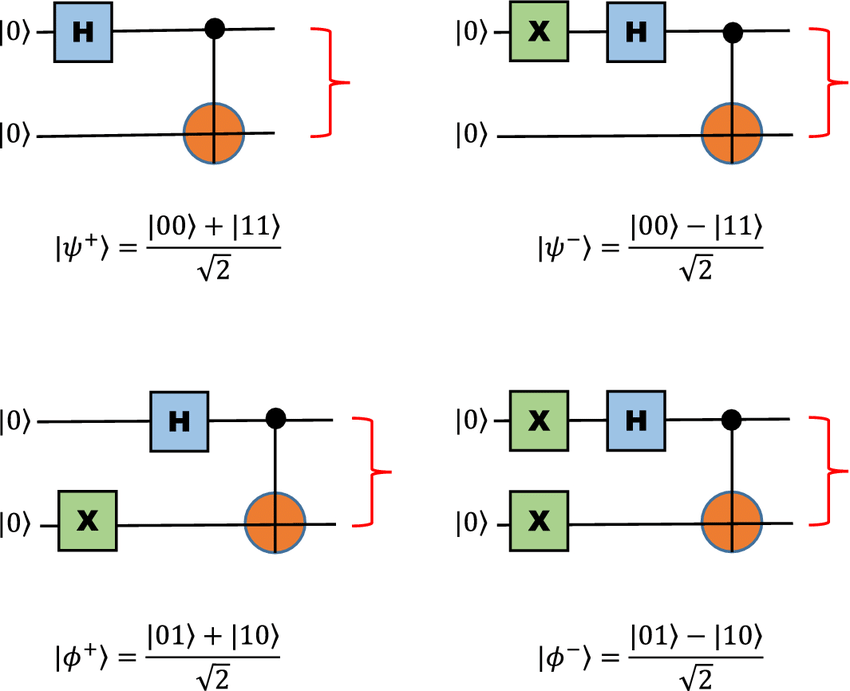
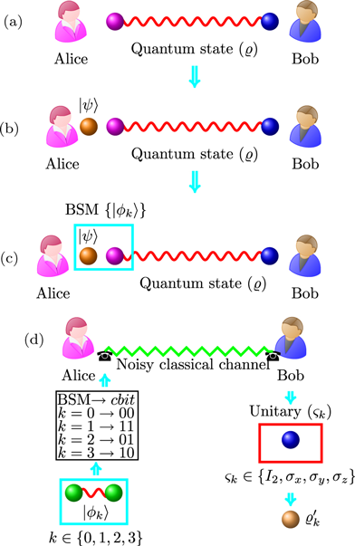

# Dia 4 — Emaranhamento Quântico

> **Data:** 16 de julho de 2026  
> **Evento:** Qiskit Global Summer School 2026  
> **Tema da aula:** Emaranhamento, desigualdade de Bell, não-localidade e teletransporte quântico

---

## Sobre estas anotações

Estas anotações foram produzidas a partir do conteúdo apresentado durante a live do **Qiskit Global Summer School 2026**, promovido pela IBM Quantum.

Ou seja, eu só reorganizei os conceitos e reescrevi de acordo com o que compreendi durante a apresentação.

---


## Resumo do Dia 4

Neste quarto dia, compreendi que:

- o emaranhamento produz correlações que não podem ser explicadas por modelos clássicos locais;
- em correlações clássicas, os valores podem estar definidos antes da observação;
- em um estado emaranhado, o sistema global pode estar definido mesmo quando os qubits individuais não possuem estados puros definidos;
- os estados de Bell são exemplos de estados maximamente emaranhados;
- o estado $|\Phi^+\rangle$ produz os resultados $00$ e $11$ com a mesma probabilidade;
- a desigualdade CHSH estabelece o limite clássico $|S|\leq2$;
- a mecânica quântica permite alcançar $|S|\leq2\sqrt{2}$;
- experimentos observaram violações das desigualdades de Bell;
- emaranhamento não permite comunicação mais rápida que a luz;
- um estado quântico desconhecido não pode ser copiado perfeitamente;
- emaranhamento sozinho não garante vantagem computacional;
- o teletransporte transfere um estado quântico, e não matéria;
- o protocolo usa um par emaranhado e dois bits clássicos;
- o par emaranhado é consumido durante o teletransporte;
- o teletransporte é uma base para redes e repetidores quânticos.

---
# O que é emaranhamento quântico?

<p align="center">
  
</p>
<p align="center">
  <em>Preparação do estado de Bell $|\Phi^+\rangle = \frac{|00\rangle+|11\rangle}{\sqrt{2}}$, utilizando uma porta Hadamard seguida de uma CNOT.</em>
</p>

O emaranhamento ocorre quando dois ou mais sistemas são descritos por um único estado quântico conjunto que não pode ser separado em estados individuais independentes.

Um estado separável pode ser escrito como:

$$|1\rangle = |\phi\rangle \otimes |\chi\rangle$$

Em um estado emaranhado, essa decomposição não é possível.

Um exemplo é:

$$|\Phi^+\rangle = \frac{|00\rangle+|11\rangle}{\sqrt{2}}$$

Não existem estados individuais $|\phi\rangle$ e $|\chi\rangle$ capazes de satisfazer:

$$|\Phi^+\rangle = |\phi\rangle \otimes |\chi\rangle$$

---

# Correlação clássica

## Exemplo das luvas

Imagine duas caixas. Em uma delas existe uma luva esquerda e, na outra, uma luva direita.

Alice recebe uma caixa e Bob recebe a outra.

Quando Alice abre sua caixa e encontra a luva esquerda, ela sabe que Bob possui a luva direita.

Porém, as luvas já estavam definidas antes da observação.

A medição apenas revelou uma informação que já existia.

---
# Correlação quântica

Considere novamente:

$$|\Phi^+\rangle = \frac{|00\rangle+|11\rangle}{\sqrt{2}}$$

Ao medir os dois qubits na base computacional:

| Resultado | Probabilidade |
|:---:|:---:|
| $00$ | $50\%$ |
| $11$ | $50\%$ |
| $01$ | $0\%$ |
| $10$ | $0\%$ |

Os resultados individuais são aleatórios, mas os resultados conjuntos são perfeitamente correlacionados.

O estado global é puro e conhecido. Porém, cada qubit isolado é descrito por:

$$\rho_A = \rho_B = \frac{I}{2}$$

Ou seja, cada qubit isolado parece maximamente misto.

---
# Estados de Bell

Existem quatro estados de Bell:

$$|\Phi^+\rangle = \frac{|00\rangle+|11\rangle}{\sqrt{2}}$$

$$|\Phi^-\rangle = \frac{|00\rangle-|11\rangle}{\sqrt{2}}$$

$$|\Psi^+\rangle = \frac{|01\rangle+|10\rangle}{\sqrt{2}}$$

$$|\Psi^-\rangle = \frac{|01\rangle-|10\rangle}{\sqrt{2}}$$

Todos são estados de dois qubits maximamente emaranhados.

---
## Preparação de $|\Phi^+\rangle$

Começamos com:

$$|00\rangle$$

Aplicamos uma porta Hadamard no primeiro qubit:

$$|00\rangle \xrightarrow{H\otimes I} \frac{|00\rangle+|10\rangle}{\sqrt{2}}$$

Depois aplicamos uma CNOT:

$$\frac{|00\rangle+|10\rangle}{\sqrt{2}} \xrightarrow{CX} \frac{|00\rangle+|11\rangle}{\sqrt{2}}$$

---

## Implementação no Qiskit

```python
from qiskit import QuantumCircuit

qc = QuantumCircuit(2, 2)

qc.h(0)
qc.cx(0, 1)
qc.measure([0, 1], [0, 1])

qc.draw("mpl")
```

Em um simulador ideal, os resultados esperados são:

```text
00
11
```

cada um com aproximadamente $50\%$ de ocorrência.

---

# Realismo local

## Realismo

O realismo assume que propriedades físicas possuem valores definidos antes da medição.

## Localidade

A localidade assume que uma ação realizada em uma região não pode produzir uma influência causal instantânea em outra região distante.

## Variáveis ocultas locais

Uma teoria de variáveis ocultas locais supõe que:

- cada partícula carrega instruções predefinidas;
- essas instruções são criadas na fonte comum;
- cada resultado depende apenas da configuração local;
- nenhuma influência mais rápida que a luz ocorre entre os observadores.

---

# Desigualdade CHSH

CHSH refere-se a:

```text
Clauser
Horne
Shimony
Holt
```
Alice escolhe entre duas medições:

$$A_0 \quad\text{e}\quad A_1$$

Bob escolhe entre:

$$B_0 \quad\text{e}\quad B_1$$

O parâmetro CHSH é:

$$S = E(A_0,B_0) + E(A_0,B_1) + E(A_1,B_0) - E(A_1,B_1)$$

Para teorias locais:

$$|S|\leq2$$

A mecânica quântica permite:

$$|S|\leq2\sqrt{2}$$

Como:

$$2\sqrt{2}\approx2{,}828$$

a previsão quântica pode ultrapassar o limite clássico.

Quando um experimento observa:

$$|S|>2$$

as correlações não podem ser explicadas por uma teoria de variáveis ocultas locais.

---

# Não-localidade quântica

A violação das desigualdades de Bell mostra que as correlações quânticas não podem ser reproduzidas por modelos locais de variáveis ocultas.

Isso é chamado de:

```text
não-localidade quântica
```

Entretanto, isso não significa:

- envio instantâneo de mensagens;
- transmissão de energia mais rápida que a luz;
- transporte instantâneo de matéria;
- controle remoto dos resultados.

A não-localidade está nas correlações, e não em sinais trafegando entre Alice e Bob.

---

# Teorema da não-comunicação

Alice e Bob observam resultados locais aleatórios.

Alice não consegue escolher se sua medição produzirá $0$ ou $1$.

Por isso, ela não consegue codificar uma mensagem controlada apenas escolhendo medir seu qubit.

As correlações só aparecem quando Alice e Bob comparam os resultados.

Essa comparação exige um canal clássico, como:

- internet;
- rádio;
- fibra óptica;
- telefone.

Esse canal permanece limitado pela velocidade da luz.

---
# Teorema da não-clonagem

O teorema da não-clonagem afirma que um estado quântico arbitrário e desconhecido não pode ser copiado perfeitamente.

Não existe uma operação universal capaz de realizar:

$$|\psi\rangle|0\rangle \longrightarrow |\psi\rangle|\psi\rangle$$

para qualquer estado $|\psi\rangle$.

---

## Demonstração pela linearidade

Suponha uma operação $U$ capaz de copiar:

$$U|0\rangle|0\rangle = |0\rangle|0\rangle$$

e:

$$U|1\rangle|0\rangle = |1\rangle|1\rangle$$

Para:

$$|+\rangle = \frac{|0\rangle+|1\rangle}{\sqrt{2}}$$

a linearidade produziria:

$$U|+\rangle|0\rangle = \frac{|00\rangle+|11\rangle}{\sqrt{2}}$$

Mas uma cópia perfeita seria:

$$|+\rangle|+\rangle = \frac{|00\rangle+|01\rangle+|10\rangle+|11\rangle}{2}$$

Como os resultados são diferentes, uma máquina universal de clonagem não pode existir.

---

## Implicações

Na criptografia quântica, um invasor não pode copiar perfeitamente o estado sem risco de produzir perturbações detectáveis.

Na correção de erros quânticos, a estratégia não é copiar o qubit. A informação é codificada e distribuída entre vários qubits físicos:

```text
codificar, não clonar
```

---

# Emaranhamento e vantagem quântica

O emaranhamento é um recurso importante, mas não garante vantagem computacional automaticamente.

Algoritmos quânticos úteis combinam:

- superposição;
- emaranhamento;
- evolução coerente;
- controle de fase;
- interferência construtiva;
- interferência destrutiva.

O algoritmo de Grover utiliza interferência para reduzir uma busca não estruturada de:

$$O(N)$$

para aproximadamente:

$$O(\sqrt{N})$$

---

# Teletransporte quântico
<p align="center">
  
</p>

<p align="center">
  <em>
    Representação de um protocolo de teletransporte quântico utilizando
    estados quasi-Bell. Alice realiza uma medição na base de Bell e envia
    o resultado clássico para Bob, que aplica uma operação unitária para
    reconstruir o estado recebido.
    Fonte: Aremua e Gouba (2024).
  </em>
</p>
O teletransporte quântico transfere o estado de um qubit para outro qubit distante.

Ele não transporta:

- matéria;
- partículas;
- pessoas;
- objetos físicos.

O que é reconstruído no destino é o estado quântico original.
# Configuração do protocolo

O protocolo utiliza três qubits.

## Qubit $Q$

Pertence a Alice e contém o estado desconhecido:

$$|\psi\rangle = \alpha|0\rangle+\beta|1\rangle$$

## Qubit $A$

É a metade do par emaranhado que pertence a Alice.

## Qubit $B$

É a metade do par emaranhado que pertence a Bob.

Os qubits $A$ e $B$ são preparados em:

$$|\Phi^+\rangle_{AB} = \frac{|00\rangle+|11\rangle}{\sqrt{2}}$$

---

# Etapas do teletransporte

## Etapa 1 — Criar o par de Bell

Alice e Bob compartilham um par emaranhado.

No circuito, aplicamos:

```text
H em A
CX de A para B
```

---

## Etapa 2 — Operações de Alice

Alice aplica:

```text
CX de Q para A
H em Q
```

Depois, mede os qubits $Q$ e $A$.

---

## Etapa 3 — Envio dos bits clássicos

As medições produzem dois bits clássicos:

$$
c_0
\quad\text{e}\quad
c_1
$$

Alice envia esses dois bits para Bob por um canal clássico.

---

## Etapa 4 — Correções de Bob

Bob aplica correções ao seu qubit de acordo com os bits recebidos.

| Resultado de Alice | Correção |
|:---:|---|
| $00$ | nenhuma |
| $01$ | $X$ |
| $10$ | $Z$ |
| $11$ | $XZ$ |

Após a correção, o qubit de Bob passa a estar em:

$$|\psi\rangle=\alpha|0\rangle+\beta|1\rangle$$

---

# Estado de Bob antes da mensagem

Antes de receber os bits clássicos, Bob não sabe qual correção aplicar.

Seu qubit parece maximamente misto:

$$\rho_B=\frac{I}{2}$$

As estatísticas locais de Bob permanecem aleatórias.

Por isso, ele não consegue recuperar a informação antes da mensagem de Alice.

---

# Circuito de teletransporte no Qiskit

```python
from qiskit import QuantumCircuit
from qiskit.circuit import Parameter

theta = Parameter("θ")
phi = Parameter("φ")
lam = Parameter("λ")

qc = QuantumCircuit(3, 2)

# q0: estado a ser teletransportado
# q1: qubit de Alice
# q2: qubit de Bob

qc.u(theta, phi, lam, 0)
qc.barrier()

# Cria o par de Bell
qc.h(1)
qc.cx(1, 2)
qc.barrier()

# Operações de Alice
qc.cx(0, 1)
qc.h(0)
qc.barrier()

# Medições
qc.measure(0, 0)
qc.measure(1, 1)

qc.draw("mpl")
```

Conceitualmente, Bob realiza:

```text
se c1 = 1, aplicar X em q2
se c0 = 1, aplicar Z em q2
```

---

# Por que não existe cópia?

Depois das medições de Alice:

- o estado original em $Q$ deixa de existir;
- o par emaranhado é consumido;
- Bob recupera o estado após as correções.

Assim, o teletransporte respeita o teorema da não-clonagem.

Ao final, não existem duas cópias perfeitas do estado.

---

# Emaranhamento como recurso consumível

O par de Bell é gasto durante o protocolo.

Para cada novo teletransporte, é necessário:

- criar um novo par emaranhado;
- distribuir uma metade para Alice;
- distribuir a outra metade para Bob.

---

# Redes quânticas

O teletransporte é um protocolo importante para:

- redes quânticas;
- repetidores quânticos;
- comunicação entre processadores;
- computação quântica distribuída;
- transferência de estados;
- futura internet quântica.

Repetidores quânticos podem utilizar:

- distribuição de emaranhamento;
- memórias quânticas;
- purificação de emaranhamento;
- troca de emaranhamento;
- teletransporte.

---

# Comparação dos conceitos

| Conceito | Interpretação |
|---|---|
| Correlação clássica | Valores podem existir antes da observação |
| Emaranhamento | Estado global não separável |
| Desigualdade CHSH | Testa limites de teorias locais |
| Violação de Bell | Incompatibilidade com variáveis ocultas locais |
| Não-comunicação | Emaranhamento não envia mensagens instantâneas |
| Não-clonagem | Estados desconhecidos não podem ser copiados perfeitamente |
| Teletransporte | Transfere um estado usando emaranhamento e bits clássicos |
| Rede quântica | Conecta sistemas usando recursos quânticos |

---

## Conclusão

O emaranhamento é um fenômeno real, mensurável e experimentalmente confirmado.

Ele produz correlações que não podem ser explicadas por modelos clássicos baseados em variáveis ocultas locais.

Entretanto, essas correlações não permitem o envio de informação mais rápida que a luz.

O teletransporte quântico demonstra como o emaranhamento pode ser utilizado para transferir estados quânticos.

O protocolo depende de:

- um par emaranhado;
- operações quânticas locais;
- duas medições;
- dois bits clássicos;
- correções realizadas por Bob.

Assim, o teletransporte respeita:

- a relatividade;
- o teorema da não-comunicação;
- o teorema da não-clonagem.

---

<p align="center">
  <a href="../README.md">Voltar para a página inicial</a>
</p>